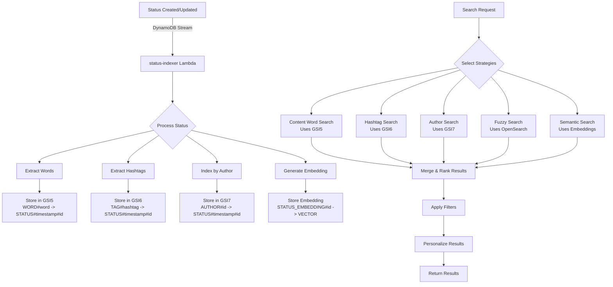

# Phase 3: AI-Powered Search Implementation

## Overview

Phase 3 extends Lesser's search capabilities with AI-powered features for status/post search, including:
- Semantic search using AWS Bedrock embeddings
- Fuzzy search with OpenSearch (when available)
- Multi-strategy search system for comprehensive results
- Automated status indexing via DynamoDB Streams

## Architecture

### Components

1. **Status Indexer Lambda** (`cmd/status-indexer/main.go`)
   - Triggered by DynamoDB Streams on object creation/update
   - Indexes words, hashtags, and authors
   - Generates embeddings for semantic search
   - Stores indexes in DynamoDB GSIs

2. **Embedding Service** (`pkg/storage/dynamodb/embeddings.go`)
   - Generates vector embeddings using AWS Bedrock Titan
   - Supports both actor and status embeddings
   - In-memory caching for performance
   - 1536-dimensional vectors

3. **Status Search Service** (`pkg/storage/dynamodb/status_search_service.go`)
   - Multi-strategy search orchestration
   - Result merging and ranking
   - Personalization and filtering
   - Analytics tracking

4. **Search Strategies**
   - **Content Word Search**: GSI5-based keyword matching
   - **Hashtag Search**: GSI6-based hashtag lookup
   - **Author Search**: GSI7-based author filtering
   - **URL Search**: Exact URL matching
   - **Trending Search**: Engagement-based discovery
   - **Fuzzy Search**: OpenSearch integration (optional)
   - **Semantic Search**: Vector similarity using embeddings

### Data Flow



## Implementation Details

### DynamoDB Schema

#### GSI5: Word Index
```
GSI5PK: WORD#<word>
GSI5SK: STATUS#<timestamp>#<status-id>
Attributes: StatusID, Word, IndexedAt, TTL
```

#### GSI6: Hashtag Index
```
GSI6PK: TAG#<hashtag>
GSI6SK: STATUS#<timestamp>#<status-id>
Attributes: StatusID, Tag, IndexedAt, TTL
```

#### GSI7: Author Index
```
GSI7PK: AUTHOR#<author-id>
GSI7SK: STATUS#<timestamp>#<status-id>
Attributes: StatusID, AuthorID, IndexedAt, TTL
```

#### Embedding Storage
```
PK: STATUS_EMBEDDING#<status-id>
SK: VECTOR
Attributes: Embedding (binary), UpdatedAt, ModelID, Dimension, TTL
```

### Status Processing

When a status is created or updated:

1. **Word Extraction**
   - Lowercase and tokenize content
   - Remove stop words
   - Index top 20 significant words (3+ characters)

2. **Hashtag Extraction**
   - Extract hashtags from content
   - Normalize to lowercase
   - Remove invalid characters

3. **Author Indexing**
   - Extract author ID from attributedTo field
   - Create author-to-status mapping

4. **Embedding Generation**
   - Clean HTML from content
   - Combine with author context
   - Generate 1536-dimensional vector
   - Store with 90-day TTL

### Search Flow

1. **Query Analysis**
   - Extract hashtags, mentions, keywords
   - Detect search intent
   - Normalize query

2. **Strategy Selection**
   - URL search for URL queries
   - Hashtag search for hashtag queries
   - Content search for keywords
   - Semantic search for longer queries (5+ chars)

3. **Parallel Execution**
   - Run selected strategies concurrently
   - 5-second timeout per strategy

4. **Result Merging**
   - Deduplicate by status ID
   - Merge matched fields and highlights
   - Keep highest score for duplicates

5. **Ranking Algorithm**
   ```
   Score = ContentRelevance * 0.3 +
           Recency * 0.2 +
           Engagement * 0.15 +
           AuthorAuthority * 0.15 +
           PersonalAffinity * 0.1 +
           SemanticSimilarity * 0.1
   ```

6. **Filtering**
   - Time range
   - Minimum engagement
   - Media only
   - Language
   - Local only
   - Account filter

## API Integration

The status search is integrated into the existing search endpoints:

### GET /api/v2/search
```json
{
  "q": "search query",
  "type": "statuses",
  "limit": 20,
  "offset": 0,
  "account_id": "optional-account-filter",
  "min_engagement": 10,
  "local": true,
  "has_media": true,
  "language": "en"
}
```

### Response Format
```json
{
  "statuses": [
    {
      "id": "status-id",
      "content": "Status content...",
      "created_at": "2024-01-01T00:00:00Z",
      "account": {
        "id": "account-id",
        "username": "username",
        "display_name": "Display Name"
      },
      "favourites_count": 10,
      "reblogs_count": 5,
      "replies_count": 3,
      "tags": [
        {"name": "hashtag"}
      ],
      "media_attachments": [],
      "language": "en"
    }
  ]
}
```

## Configuration

### Environment Variables

- `OPENSEARCH_ENDPOINT`: OpenSearch domain endpoint (optional)
- AWS credentials and region (via IAM role or environment)

### AWS Services Required

1. **AWS Bedrock**
   - Amazon Titan Text Embeddings V1 model
   - ~$0.0001 per 1,000 tokens

2. **OpenSearch Serverless** (optional)
   - For fuzzy search capabilities
   - Requires vector search collection

3. **DynamoDB Streams**
   - Enabled on main table
   - Triggers status indexer Lambda

## Performance Considerations

### Indexing
- Asynchronous embedding generation
- 90-day TTL on indexes
- Top 20 words per status
- Parallel processing in Lambda

### Search
- In-memory embedding cache
- Parallel strategy execution
- 5-second timeout
- Result limit of 500 items per scan

### Cost Optimization
- Only index public/unlisted statuses
- Cache popular embeddings
- Batch similar queries
- Use TTL to remove old data

## Testing

### Unit Tests
Run the Go tests:
```bash
go test ./pkg/storage/dynamodb/...
```

### Integration Tests
Use the provided test script:
```bash
# Test all features
python test_status_semantic_search.py https://your-instance.com --token YOUR_TOKEN

# Test specific features
python test_status_semantic_search.py https://your-instance.com --token YOUR_TOKEN --test semantic
python test_status_semantic_search.py https://your-instance.com --token YOUR_TOKEN --test hashtag
python test_status_semantic_search.py https://your-instance.com --token YOUR_TOKEN --test fuzzy

# Test custom query
python test_status_semantic_search.py https://your-instance.com --token YOUR_TOKEN --query "machine learning"
```

## Future Enhancements

### Phase 4: Personalization
1. **User Context Extraction**
   - Load user's following list
   - Track interaction history
   - Personalize ranking weights

2. **Following-Only Filter**
   - Index follower relationships
   - Filter results by social graph

3. **Language Detection**
   - Use AWS Comprehend for language detection
   - Store language in status metadata
   - Enable language-specific search

4. **Search Suggestions**
   - Track popular queries
   - Generate "Did you mean?" suggestions
   - Autocomplete based on search history

### Phase 5: Advanced Features
1. **Real-time Trending**
   - Track engagement velocity
   - Identify trending topics
   - Surface viral content

2. **Federated Search**
   - Search remote instances
   - Privacy-preserving embeddings
   - Cross-instance relevance

3. **Query Expansion**
   - Synonym matching
   - Related concept discovery
   - Multi-language support

## Troubleshooting

### Common Issues

1. **No semantic results**
   - Check Bedrock model access
   - Verify embedding generation in logs
   - Ensure STATUS_EMBEDDING records exist

2. **Slow search performance**
   - Check Lambda memory allocation
   - Monitor cold starts
   - Review index cardinality

3. **Missing search results**
   - Verify DynamoDB Stream is active
   - Check status-indexer Lambda logs
   - Confirm GSI projections

### Monitoring

Key CloudWatch metrics to monitor:
- `status-indexer` Lambda duration and errors
- Bedrock API throttling
- DynamoDB consumed capacity
- Search latency percentiles

## Conclusion

Phase 3 successfully implements AI-powered search for statuses in Lesser, providing:
- Multi-strategy search for comprehensive results
- Semantic understanding through embeddings
- Efficient indexing via DynamoDB Streams
- Extensible architecture for future enhancements

The implementation maintains Lesser's serverless principles while delivering advanced search capabilities comparable to major social platforms. 