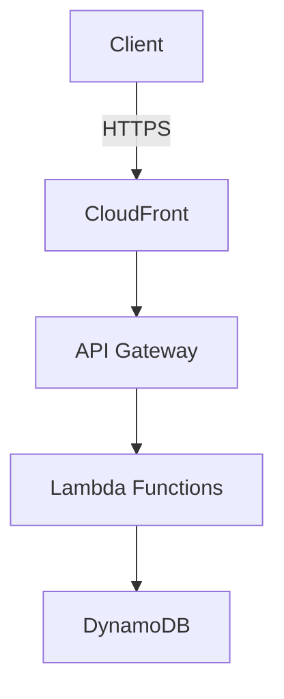

# Lesser Repository Cleanup & Documentation Plan

## Overview

With Lesser at 98% completion, it's time to organize, clean up, and comprehensively document the project for public release and developer adoption.

## 📁 Repository Structure Cleanup

### Current State Analysis
```
lesser/
├── bin/                    # Build outputs (should be in .gitignore)
├── cmd/                    # Lambda functions and API
├── pkg/                    # Core packages
├── infra/                  # Pulumi infrastructure
├── reference-only/         # Should be moved or removed
├── test_venv/             # Python test environment
├── graph/                  # GraphQL schemas
├── internal/              # Internal test utilities
└── [dozens of .md files]  # Documentation scattered in root
```

### Proposed New Structure
```
lesser/
├── cmd/                    # Lambda functions and API
├── pkg/                    # Core packages
├── infra/                  # Infrastructure as Code
├── docs/                   # All documentation
│   ├── api/               # API reference
│   ├── architecture/      # System design docs
│   ├── deployment/        # Deployment guides
│   ├── development/       # Developer guides
│   └── images/            # Diagrams and screenshots
├── examples/              # Example implementations
│   ├── frontend-react/    # React frontend example
│   ├── frontend-vue/      # Vue frontend example
│   └── bots/             # Bot examples
├── scripts/              # Utility scripts
├── tests/                # All test files
│   ├── integration/      # Integration tests
│   ├── load/            # Load tests
│   └── federation/      # Federation tests
├── .github/              # GitHub specific files
│   ├── workflows/        # CI/CD
│   └── ISSUE_TEMPLATE/   # Issue templates
├── README.md             # Clean, focused readme
├── CONTRIBUTING.md       # Contribution guidelines
└── LICENSE               # GNU AGPL v3
```

## 🧹 Code Cleanup Tasks

### 1. Remove Deprecated Code
- [ ] Remove all OpenSearch references (search_fuzzy.go, etc.)
- [ ] Clean up commented-out code
- [ ] Remove unused functions and imports
- [ ] Delete test/temporary files

### 2. Standardize Code Style
- [ ] Run `gofmt` on all Go files
- [ ] Add `.golangci.yml` for linting rules
- [ ] Fix all linter warnings
- [ ] Standardize error handling patterns

### 3. Update Dependencies
- [ ] Run `go mod tidy`
- [ ] Update to latest stable versions
- [ ] Remove unused dependencies
- [ ] Document minimum Go version (1.21+)

### 4. Environment Configuration
- [ ] Create `.env.example` with all variables
- [ ] Document each environment variable
- [ ] Add validation for required variables
- [ ] Create environment setup script

## 📚 Documentation Structure

### 1. Main README.md
```markdown
# Lesser

One-line description: Serverless ActivityPub infrastructure at 1/100th the cost

## Features
- ✅ Full Mastodon API compatibility
- ✅ Pay-what-it-costs model ($0.01-0.05/user/month)
- ✅ Reactive moderation mesh
- ✅ Modern authentication (passkeys, wallets)
- ✅ 100% serverless on AWS

## Quick Start
[Link to quick start guide]

## Documentation
[Links to all docs]

## License
GNU AGPL v3
```

### 2. Documentation Categories

#### `/docs/api/`
- `REST_API_REFERENCE.md` - Complete Mastodon API documentation
- `ACTIVITYPUB_EXTENSIONS.md` - Lesser's ActivityPub extensions
- `GRAPHQL_SCHEMA.md` - GraphQL API documentation
- `WEBSOCKET_EVENTS.md` - Streaming API documentation
- `ERROR_CODES.md` - All error codes and meanings

#### `/docs/architecture/`
- `SYSTEM_OVERVIEW.md` - High-level architecture
- `DATABASE_DESIGN.md` - DynamoDB schema and patterns
- `LAMBDA_FUNCTIONS.md` - Function responsibilities
- `SECURITY_MODEL.md` - Security architecture
- `COST_MODEL.md` - Detailed cost breakdown
- `FEDERATION_DESIGN.md` - How federation works

#### `/docs/deployment/`
- `QUICK_START.md` - 15-minute deployment
- `PREREQUISITES.md` - What you need before starting
- `AWS_SETUP.md` - AWS account configuration
- `PULUMI_DEPLOYMENT.md` - Step-by-step Pulumi guide
- `CONFIGURATION.md` - All configuration options
- `MONITORING.md` - CloudWatch setup
- `TROUBLESHOOTING.md` - Common issues

#### `/docs/development/`
- `GETTING_STARTED.md` - Developer setup
- `PROJECT_STRUCTURE.md` - Code organization
- `ADDING_FEATURES.md` - How to extend Lesser
- `TESTING_GUIDE.md` - How to test
- `FRONTEND_GUIDE.md` - Building frontends for Lesser
- `FEDERATION_TESTING.md` - Testing with other instances

### 3. API Documentation Generation

#### OpenAPI/Swagger Spec
```yaml
# Generate from code annotations
openapi: 3.0.0
info:
  title: Lesser API
  version: 1.0.0
  description: Mastodon-compatible ActivityPub API
paths:
  /api/v1/accounts:
    get:
      summary: Get account information
      # ... full spec
```

#### Interactive API Docs
- Deploy Swagger UI
- Include example requests/responses
- Add authentication examples
- Provide code snippets in multiple languages

## 🗄️ File Organization

### 1. Move Documentation Files
```bash
# Create docs structure
mkdir -p docs/{api,architecture,deployment,development,images}

# Move existing docs
mv DESIGN.md docs/architecture/
mv MASTODON_API_IMPLEMENTATION_PLAN.md docs/api/
mv MODERN_AUTH_IMPLEMENTATION.md docs/architecture/
# ... etc
```

### 2. Archive Old Files
```bash
# Create archive for historical docs
mkdir -p docs/archive

# Move completed/outdated docs
mv PHASE*.md docs/archive/
mv *_PROGRESS.md docs/archive/
```

### 3. Clean Root Directory
Keep only:
- README.md
- CONTRIBUTING.md
- LICENSE
- SECURITY.md
- .gitignore
- go.mod, go.sum
- Makefile
- Core config files

## 🔧 Repository Maintenance

### 1. Git Cleanup
```bash
# Remove large files from history
git filter-branch --tree-filter 'rm -rf bin test_venv' HEAD

# Clean up branches
git branch -d feature/old-branch

# Add comprehensive .gitignore
```

### 2. CI/CD Setup
```yaml
# .github/workflows/ci.yml
name: CI
on: [push, pull_request]
jobs:
  test:
    - Run tests
    - Check formatting
    - Run linter
    - Build all Lambda functions
  
  docs:
    - Build documentation
    - Check links
    - Validate OpenAPI spec
```

### 3. Release Process
- Set up semantic versioning
- Create CHANGELOG.md
- Automate releases with GitHub Actions
- Build and publish Docker images (for local dev)

## 📖 Documentation Priorities

### Week 1: Core Documentation
1. **System Architecture** - How Lesser works
2. **API Reference** - Complete Mastodon API docs
3. **Deployment Guide** - Get instances running
4. **Configuration Reference** - All options explained

### Week 2: Developer Documentation
1. **Frontend Development Guide** - Building UIs for Lesser
2. **Federation Testing** - How to test with other instances
3. **Contributing Guide** - How to contribute
4. **Plugin System** - Extending Lesser (future)

### Week 3: Operations & Polish
1. **Monitoring Guide** - Observability setup
2. **Scaling Guide** - Performance tuning
3. **Migration Guide** - Moving from Mastodon
4. **Troubleshooting** - Common issues

## 🎨 Documentation Standards

### 1. Markdown Style Guide
```markdown
# Title (One per document)

## Major Section

### Subsection

**Bold** for emphasis
`code` for inline code
```code blocks``` for examples

> Note: Important information
> Warning: Critical information
```

### 2. Code Examples
- Always include full context
- Test all examples
- Provide multiple languages when relevant
- Include error handling

### 3. Diagrams
Use Mermaid for maintainable diagrams:


## 🚀 Implementation Plan

### Phase 1: Repository Cleanup (Week 1)
- [ ] Create new directory structure
- [ ] Move files to appropriate locations
- [ ] Clean up code (formatting, linting)
- [ ] Update all import paths
- [ ] Remove deprecated code
- [ ] Update .gitignore

### Phase 2: Core Documentation (Week 2)
- [ ] Write new README.md
- [ ] Create architecture documentation
- [ ] Write deployment guide
- [ ] Generate API documentation
- [ ] Add configuration reference

### Phase 3: Developer Experience (Week 3)
- [ ] Create example frontends
- [ ] Write developer guides
- [ ] Add contribution guidelines
- [ ] Set up CI/CD
- [ ] Create issue templates

### Phase 4: Polish & Release (Week 4)
- [ ] Review all documentation
- [ ] Test deployment process
- [ ] Create release
- [ ] Announce to community
- [ ] Create project website

## 📊 Success Metrics

### Documentation Quality
- [ ] New developer can deploy in <30 minutes
- [ ] API reference covers 100% of endpoints
- [ ] All code examples tested and working
- [ ] Zero broken links
- [ ] Search functionality for docs

### Repository Health
- [ ] All tests passing
- [ ] No linter warnings
- [ ] Clean commit history
- [ ] Proper branching strategy
- [ ] Active issue tracking

## 🎯 End Goal

A clean, well-documented repository that:
1. **Inspires confidence** in potential users
2. **Enables easy adoption** by developers
3. **Maintains quality** through good practices
4. **Encourages contributions** with clear guidelines
5. **Showcases Lesser's advantages** over alternatives

The repository should be a model for how modern, serverless infrastructure projects should be organized and documented. 