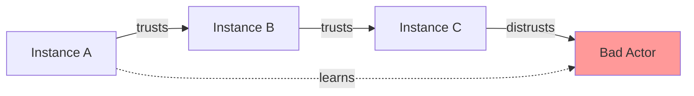

# Lesser Features: What Makes Us Different

Lesser isn't just another ActivityPub implementation - it's a complete reimagining of how social media infrastructure should work. Here's what makes Lesser special.

## 🚀 Serverless-First Architecture

### The Problem with Traditional Hosting
- Paying for servers 24/7, even when idle (often 90%+ of the time)
- Complex scaling requiring manual intervention
- High minimum costs making self-hosting impractical
- Maintenance overhead eating up time and money

### The Lesser Solution
- **Pay only for actual usage** - If no one's online, you pay nothing
- **Infinite automatic scaling** - From 0 to millions of requests instantly
- **No maintenance** - AWS handles all infrastructure updates
- **Global performance** - Built-in CDN and edge computing

**Real Impact**: Run your own instance for the price of a coffee per month.

## 💰 Revolutionary Cost Tracking

### Complete Cost Transparency
Every action in Lesser is tracked for cost:

```json
{
  "action": "post_status",
  "user": "alice",
  "costs": {
    "lambda_compute": 0.000021,
    "dynamodb_write": 0.000013,
    "s3_storage": 0.000002,
    "total": 0.000036
  }
}
```

### Features
- **Per-user cost tracking** - Know exactly what each user costs
- **Per-feature breakdown** - See which features drive costs
- **Budget alerts** - Get notified before overspending
- **Cost optimization tips** - AI-powered suggestions to reduce costs

**Why it matters**: Finally understand and control your social media infrastructure costs.

## 🔐 Modern Authentication

### Beyond Passwords
Lesser supports authentication methods that are both more secure and more convenient:

#### Passkeys/WebAuthn
- **No passwords to leak** - Cryptographic authentication
- **Phishing-proof** - Can't be tricked by fake sites
- **Touch/Face ID** - Use your device's biometrics
- **Cross-device** - Sync across all your devices

#### Crypto Wallet Authentication
- **Web3 native** - Sign in with Ethereum, Solana, etc.
- **Decentralized identity** - You own your login
- **No email required** - Privacy-first approach
- **Instant onboarding** - One click to join

#### Traditional Options
- username/password (with proper security)
- OAuth2 (Google, GitHub, etc.)

**Real Impact**: Users can join your instance without giving up their privacy or security.

## 🤖 AI-Powered Features

### Semantic Search
Traditional search finds exact matches. Lesser understands meaning:

- Search: "posts about cooking"
- Finds: Recipes, restaurant reviews, food photos
- Even in different languages!

### Automatic Translation
- **Real-time translation** - Read posts in any language
- **Preserve tone** - Maintains humor, sarcasm, emotion
- **Cost-efficient** - Cached translations save money
- **Privacy-aware** - On-device options available

### Content Understanding
- **Smart summaries** - Digest long threads instantly
- **Topic extraction** - Automatic hashtag suggestions
- **Sentiment analysis** - Understand community mood
- **Accessibility** - Auto alt-text for images

**Why it matters**: Break down language barriers and make content more accessible.

## 🛡️ Reactive Moderation Mesh

### Community-Driven Safety
Lesser's moderation isn't top-down - it's a mesh network of trust:



### How it Works
1. **Local decisions** - Each instance sets its own rules
2. **Trust propagation** - Learn from instances you trust
3. **Reputation scoring** - Build reputation over time
4. **Automatic adaptation** - Network learns and improves

### Features
- **Flexible rules** - Define your community standards
- **AI assistance** - Flag potential issues automatically
- **Transparent process** - See why content was flagged
- **User appeals** - Fair process for disputes

**Real Impact**: Safer communities without centralized censorship.

## 🌐 Federation Enhancements

### Beyond Basic ActivityPub
Lesser extends the protocol for better federation:

#### Smart Relay
- **Selective federation** - Choose who to federate with
- **Content filtering** - Filter incoming content by rules
- **Bandwidth optimization** - Compress federation traffic
- **Cost controls** - Limit federation costs

#### Enhanced Profiles
- **Verified links** - Prove website ownership
- **Rich media** - Better preview cards
- **Pronouns field** - Built-in inclusivity
- **Custom fields** - Extend profiles your way

#### Better Threads
- **Full thread fetching** - Get complete conversations
- **Quote post support** - Proper quote functionality
- **Edit federation** - Edits propagate correctly
- **Reaction variety** - Beyond just favorites

**Why it matters**: Better integration with the wider Fediverse.

## 📊 Analytics & Insights

### Privacy-Respecting Analytics
Understand your community without invading privacy:

- **Aggregate trends** - See what's popular
- **Growth metrics** - Track instance health
- **Federation stats** - Understand your reach
- **No tracking** - All privacy-safe

### Admin Dashboard
```
┌─────────────────────────────────────┐
│  Weekly Active Users:  1,234  ↑12%  │
│  Storage Used:         45 GB        │
│  Monthly Cost:        $12.34  ↓5%  │
│  Federation Reach:     56 instances │
└─────────────────────────────────────┘
```

## 🎨 Customization

### Your Instance, Your Rules
- **Custom themes** - Match your brand
- **Instance emojis** - Create unique reactions
- **Welcome flow** - Onboard users your way
- **API extensions** - Add custom endpoints

### White-Label Ready
- Remove Lesser branding
- Custom domain with SSL
- Your logo everywhere
- Full source access

## 🔄 Import/Export

### True Data Portability
- **Full account export** - Take everything with you
- **Mastodon compatible** - Import from any instance
- **Media included** - Don't lose your photos
- **Follower preservation** - Keep your community

### Backup Options
- **Automated backups** - Never lose data
- **Point-in-time restore** - Undo mistakes
- **Cross-region backup** - Disaster-proof
- **GDPR compliant** - User data exports

## 📱 Mobile-First

### Progressive Web App
- **Install on any device** - Works like native
- **Offline support** - Read cached content
- **Push notifications** - Stay connected
- **Small size** - Respects data limits

### API-First Design
- **Full API access** - Build anything
- **GraphQL option** - Modern data fetching
- **WebSocket streaming** - Real-time updates
- **Webhook support** - Integrate with anything

## 🚄 Performance

### Lightning Fast
- **50-200ms response times** - Feels instant
- **Global CDN** - Content near users
- **Smart caching** - Reduce redundant work
- **Optimized queries** - Efficient data access

### Scale Without Limits
- **Auto-scaling** - Handle viral moments
- **No rate limits*** - For your own users
- **Burst capacity** - Ready for spikes
- **DDoS protection** - Built-in security

*Federation has reasonable limits

## 🔮 Future-Ready

### Planned Features
- **Live streaming** - Built on AWS IVS
- **Voice Spaces** - Audio conversations
- **End-to-end encryption** - Private messaging
- **Blockchain verification** - Verify content authenticity
- **Plugin system** - Extend functionality

### Standards-Based
- **ActivityPub** - Core protocol
- **WebAuthn** - Authentication
- **OpenTelemetry** - Monitoring
- **GraphQL** - API design

## 🎯 Use Cases

### Personal Instance
- Your own social presence
- Complete control
- ~$1/month cost
- No ads, no tracking

### Community Platform
- Niche communities
- Professional networks  
- Local groups
- Educational institutions

### Business Solution
- Customer engagement
- Internal communications
- Brand presence
- Content distribution

### Developer Platform
- Build on our API
- Extend functionality
- Create integrations
- Innovate freely

## 🤝 Why Choose Lesser?

1. **Cost** - 1/100th of traditional hosting
2. **Freedom** - Own your social media
3. **Privacy** - Your data, your rules
4. **Innovation** - Modern features unavailable elsewhere
5. **Community** - Join the serverless revolution

---

<div align="center">

**Ready to experience the future of social media?**

[Deploy Now](deployment/QUICK_START.md) • [Architecture](architecture/OVERVIEW.md) • [API Docs](api/QUICK_REFERENCE.md)


</div> 