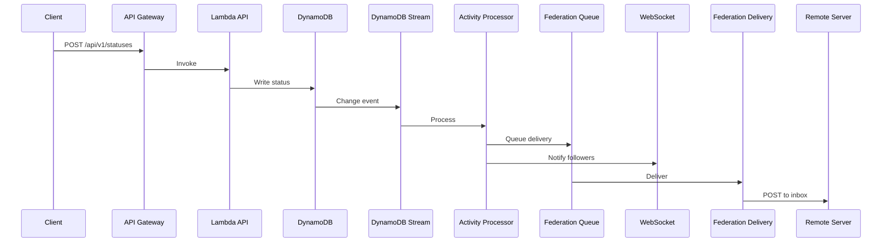

# Architecture Overview

Lesser is built on AWS serverless services using event-driven architecture and the Lift framework for Lambda patterns.

## System Components

### Lambda Functions (23 total)

#### Core API Functions
- **api**: Main REST API handler (Mastodon-compatible)
- **graphql**: GraphQL API with subscriptions
- **auth**: Authentication and authorization
- **webfinger**: User discovery endpoint

#### Federation Functions
- **inbox**: Receives ActivityPub activities
- **outbox**: Sends ActivityPub activities
- **federation-delivery**: Delivers activities to remote servers
- **federation-tracker**: Monitors federation health
- **actor**: Serves actor profiles

#### Processing Functions
- **note-processor**: Processes posts and interactions
- **media-processor**: Handles image/video uploads
- **moderation-processor**: Content moderation pipeline
- **ai-processor**: AI-powered features (search, moderation)
- **notification-processor**: Push notification delivery

#### Stream Processors
- **activity-processor**: DynamoDB stream handler
- **stream-router**: WebSocket message routing
- **streaming**: WebSocket connection handler

#### Utility Functions
- **search-indexer**: Updates search indices
- **status-indexer**: Maintains timeline indices
- **trend-aggregator**: Calculates trending topics
- **cost-aggregator**: Tracks and aggregates costs
- **metrics-aggregator**: Collects custom metrics
- **dlq-processor**: Handles failed messages
- **websocket-cost-aggregator**: WebSocket usage tracking

### Data Layer

#### DynamoDB Design
Single-table design with composite keys:

```
Primary Key Pattern:
PK: entity#identifier
SK: type#timestamp or relationship

Examples:
PK: user#alice       SK: profile
PK: user#alice       SK: post#2024-01-01T12:00:00Z
PK: post#123         SK: metadata
PK: timeline#home    SK: post#2024-01-01T12:00:00Z
```

#### Global Secondary Indexes (8)
1. **GSI1**: Timeline queries (by user and time)
2. **GSI2**: Federation lookups (by domain)
3. **GSI3**: Search indices (by content type)
4. **GSI4**: Notification queries (by recipient)
5. **GSI5**: Media references (by URL)
6. **GSI6**: Moderation queue (by status)
7. **GSI7**: Cost tracking (by resource)
8. **GSI8**: Analytics queries (by metric type)

### Storage & CDN

#### S3 Buckets
- **Media Bucket**: User uploads (images, videos, audio)
- **Static Assets**: Instance branding and static files
- **Backup Bucket**: Point-in-time backups

#### CloudFront Distribution
- Global edge caching for media
- Custom domain support
- Automatic compression
- Origin shield for cost optimization

### Messaging & Queues

#### SQS Queues
- **Federation Queue**: Outbound ActivityPub delivery
- **Federation DLQ**: Failed federation attempts
- **Push Queue**: Push notification delivery
- **Push DLQ**: Failed push notifications

#### EventBridge Rules
- Cost aggregation (hourly)
- Trend calculation (15 minutes)
- Cleanup tasks (daily)
- Backup operations (configurable)

### API Gateway

#### HTTP API Configuration
- Custom domain mapping
- JWT authorizer
- Rate limiting via AWS WAF
- Request/response transformations

#### Routes
- `/api/v1/*` - Mastodon API compatibility
- `/api/v2/*` - Mastodon v2 endpoints
- `/graphql` - GraphQL endpoint
- `/.well-known/*` - Federation discovery
- `/oauth/*` - OAuth 2.0 flows
- `/streaming` - WebSocket connections

## Request Flow

### Typical Status Creation



### Federation Incoming

```mermaid
sequenceDiagram
    Remote Server->>API Gateway: POST /inbox
    API Gateway->>Lambda Inbox: Invoke
    Lambda Inbox->>DynamoDB: Verify actor
    Lambda Inbox->>DynamoDB: Store activity
    DynamoDB->>DynamoDB Stream: Change event
    DynamoDB Stream->>Activity Processor: Process
    Activity Processor->>Note Processor: Process note
    Note Processor->>DynamoDB: Update timelines
    Note Processor->>WebSocket: Notify users
```

## Service Layer Architecture

### Domain Services
Located in `pkg/services/`:

- **AccountsService**: User management and profiles
- **NotesService**: Status creation and interactions
- **ListsService**: User list management
- **RelationshipsService**: Follows, blocks, mutes
- **NotificationsService**: Notification generation
- **MediaService**: Media upload and processing
- **FederationService**: ActivityPub operations
- **SearchService**: Multi-strategy search
- **ModerationService**: Content moderation

### Repository Pattern
Located in `pkg/storage/repositories/`:

Each service uses repositories for data access:
- Type-safe operations via DynamORM
- Automatic tenant isolation in multi-tenant mode
- Cost tracking per operation
- Audit logging

## Security Architecture

### Authentication Methods
- JWT tokens (primary)
- OAuth 2.0 (app access)
- WebAuthn (passwordless)
- Crypto wallets (Web3)

### Authorization
- Scope-based permissions
- Tenant isolation
- Row-level security in DynamoDB

### Federation Security
- HTTP signatures for all requests
- Actor verification
- Instance-level blocking
- Rate limiting per instance

## Monitoring & Observability

### CloudWatch Integration
- Lambda function metrics
- API Gateway metrics
- DynamoDB metrics
- Custom EMF metrics

### Distributed Tracing
- AWS X-Ray enabled
- Request ID propagation
- Performance bottleneck identification

### Cost Tracking
- Per-operation cost calculation
- Real-time budget enforcement
- Cost aggregation and reporting
- Instance-level cost allocation

## Scalability

### Auto-scaling Components
- Lambda: 1000 concurrent executions (default)
- DynamoDB: On-demand or auto-scaling
- SQS: Unlimited queue depth
- S3: Unlimited storage

### Performance Optimization
- Lambda ARM64 architecture (20% better price/performance)
- DynamoDB DAX (optional caching layer)
- CloudFront edge caching
- Connection pooling for external services

### Multi-Tenant Architecture
- Tenant resolution from subdomain/header
- Data isolation via partition key prefixing
- Per-tenant configuration and limits
- Separate cost tracking per tenant

## Deployment Architecture

### Infrastructure as Code
- AWS CDK v2 for infrastructure
- Lift framework for Lambda patterns
- Environment-specific configurations
- GitOps deployment pipeline

### Environment Separation
- Development: Minimal resources, DEBUG logging
- Staging: Production-like, testing features
- Production: Full monitoring, high availability

### Zero-Downtime Deployments
- Lambda versioning and aliases
- API Gateway stage deployments
- Database migrations via DynamoDB streams
- Gradual rollout capabilities
