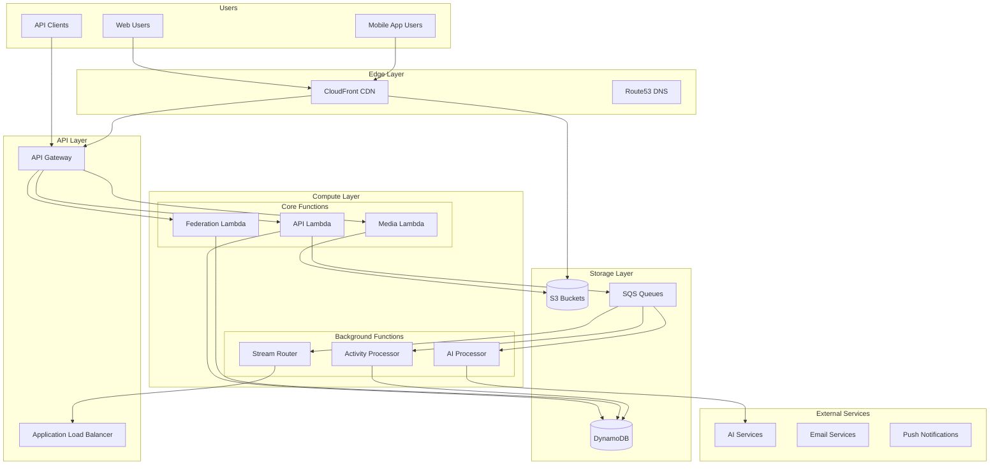
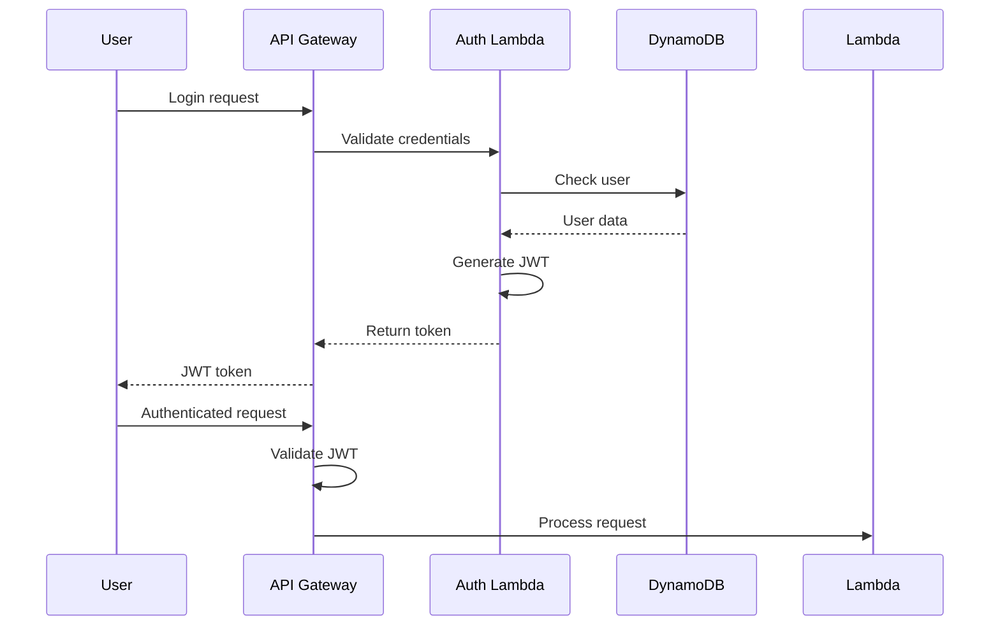

# Lesser Architecture Overview

Lesser is a revolutionary ActivityPub implementation built entirely on serverless infrastructure. This document explains how Lesser achieves 1/100th the cost of traditional hosting while maintaining full compatibility and performance.

## 🏗️ High-Level Architecture



## 💡 Why Serverless?

### Traditional Architecture Problems
- **24/7 server costs** - Pay even when idle (90%+ of the time)
- **Over-provisioning** - Size for peak load, waste resources
- **Complex scaling** - Manual intervention needed
- **Maintenance overhead** - OS updates, security patches, monitoring

### Serverless Solutions
- **Pay-per-request** - Only pay when serving users
- **Auto-scaling** - 0 to 1M+ requests/second automatically
- **Zero maintenance** - AWS handles all infrastructure
- **Global performance** - CDN and edge computing built-in

## 🧩 Core Components

### 1. API Gateway + Lambda
**Purpose**: Handle all HTTP requests with automatic scaling

**Key Features**:
- Request routing and validation
- Authentication/authorization
- Rate limiting per API key
- WebSocket support for streaming

**Cost Model**:
- $1 per million API requests
- $0.20 per million Lambda invocations
- Pay only for actual compute time used

### 2. DynamoDB
**Purpose**: Primary data store with infinite scaling

**Design Principles**:
- Single table design for efficiency
- Global secondary indexes for queries
- DynamoDB Streams for real-time updates
- On-demand pricing model

**Tables**:
```
Main Table:
- PK: Entity type + ID (e.g., "actor:123", "note:456")
- SK: Sort key for relationships
- GSI1: Timeline queries
- GSI2: Federation lookups
- GSI3: Search indexes
```

### 3. S3 + CloudFront
**Purpose**: Media storage and global distribution

**Architecture**:
- Origin bucket for uploaded media
- CloudFront for global caching
- Lambda@Edge for image processing
- Lifecycle policies for cost optimization

**Cost Optimization**:
- Intelligent tiering for old media
- Compression before storage
- Bandwidth savings via CDN

### 4. SQS Queues
**Purpose**: Decouple components and handle async processing

**Queue Design**:
```
- federation-delivery: Outbound ActivityPub
- activity-processing: Inbound activities
- media-processing: Image/video tasks
- ai-processing: ML workloads
- notification-delivery: Push notifications
```

**Benefits**:
- Reliable message delivery
- Automatic retries
- Dead letter queues
- Pay per message

## 📊 Data Flow

### 1. Incoming Federation Request
```
Remote Server → CloudFront → API Gateway → Federation Lambda
                                            ↓
                                         Validate
                                            ↓
                                    Store in DynamoDB
                                            ↓
                                    Queue for processing
                                            ↓
                                    Activity Processor
                                            ↓
                                    Update timelines
```

### 2. Creating a Post
```
User → API Gateway → API Lambda → Validate & Store
                                       ↓
                              Create activity object
                                       ↓
                              Queue for federation
                                       ↓
                              Federation delivery
                                       ↓
                              Send to followers' servers
```

### 3. Media Upload
```
User → S3 (pre-signed URL) → Upload complete
                                   ↓
                            S3 event trigger
                                   ↓
                            Media processor
                                   ↓
                            Generate thumbnails
                                   ↓
                            Update metadata
```

## 💰 Cost Breakdown

### Why 1/100th the Cost?

| Component | Traditional | Lesser | Savings |
|-----------|------------|---------|---------|
| Compute | $50-500/month (24/7 servers) | $0.50-5/month (per-request) | 99% |
| Database | $100-1000/month (RDS) | $1-10/month (DynamoDB) | 99% |
| Storage | $20-200/month (EBS) | $0.02-2/month (S3) | 99% |
| Bandwidth | Included in server | Pay-as-you-go CDN | Variable |

### Real Example (100 users/month)
```
Traditional hosting:
- 2 vCPU server: $40/month
- PostgreSQL RDS: $30/month  
- 100GB storage: $10/month
- Total: $80/month

Lesser:
- 1M API calls: $1
- 500K Lambda invocations: $0.10
- DynamoDB usage: $2
- S3 storage: $0.50
- Total: ~$3.60/month (95% savings!)
```

## 🚀 Scaling Characteristics

### Automatic Scaling
- **API Gateway**: 10,000 requests/second per region
- **Lambda**: 1,000 concurrent executions (soft limit)
- **DynamoDB**: Unlimited with on-demand
- **S3**: Unlimited storage and bandwidth

### Performance Metrics
- **API Response**: 50-200ms typical
- **Federation Delivery**: <1 second
- **Media Processing**: 2-5 seconds
- **Global Latency**: <100ms via CDN

## 🔒 Security Architecture

### Defense in Depth
1. **CloudFront**: DDoS protection, geo-blocking
2. **API Gateway**: Rate limiting, API keys
3. **Lambda**: Isolated execution, no persistent state
4. **DynamoDB**: Encryption at rest, fine-grained IAM
5. **S3**: Bucket policies, signed URLs

### Authentication Flow


## 🎯 Design Decisions

### 1. Single Table DynamoDB Design
**Why**: Minimize costs and maximize performance
- One table instead of many = lower base costs
- Efficient queries via composite keys
- Atomic operations via transactions

### 2. SQS for Async Processing
**Why**: Reliability and cost efficiency
- Don't keep Lambdas running waiting
- Automatic retries for failed operations
- Easy to monitor and debug

### 3. CloudFront for Everything
**Why**: Global performance and security
- Cache static assets at edge
- Terminate SSL at edge locations
- Built-in DDoS protection

### 4. Lambda for Compute
**Why**: True pay-per-use model
- No idle server costs
- Automatic scaling
- Built-in monitoring

## 📈 Monitoring & Observability

### CloudWatch Integration
```
Lambda Functions → CloudWatch Logs → Insights
                        ↓
                  CloudWatch Metrics
                        ↓
                  CloudWatch Alarms
                        ↓
                  SNS Notifications
```

### Key Metrics
- Request latency (p50, p90, p99)
- Error rates by function
- DynamoDB consumed capacity
- Queue depth and age
- Cost per user/feature

## 🔄 Deployment Architecture

### CI/CD Pipeline
```
GitHub → GitHub Actions → Build & Test
                              ↓
                         Package Lambda
                              ↓
                         Pulumi Deploy
                              ↓
                         Update Stack
```

### Zero-Downtime Updates
1. Deploy new Lambda versions
2. Weighted alias routing
3. Gradual traffic shift
4. Automatic rollback on errors

## 🌍 Multi-Region Considerations

Lesser is designed to run efficiently in a single region. For global performance, CloudFront CDN provides edge caching worldwide.

## 🎓 Learn More

- **[Storage Architecture](STORAGE_ARCHITECTURE.md)** - DynamoDB schema details
- **[API Design](../api/API_REFERENCE.md)** - Endpoint documentation
- **[Security Model](../security/)** - Security deep dive
- **[System Design](SYSTEM_DESIGN.md)** - Complete architecture details

---

<div align="center">

[Back to Docs](../README.md) • [Quick Start](../deployment/QUICK_START.md) • [API Reference](../api/QUICK_REFERENCE.md)

</div> 