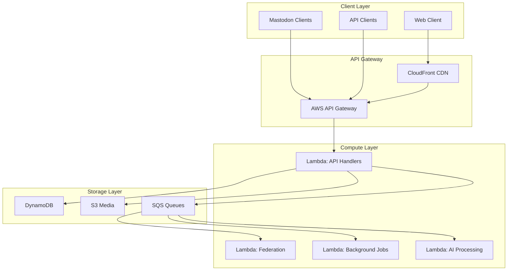

# Lesser

<div align="center">


**Serverless ActivityPub at 1/100th the cost**

[](https://golang.org)
[](LICENSE)
[]()
[](docs/README.md)

[Quick Start](#quick-start) • [Features](#key-features) • [Documentation](#documentation) • [Community](#community)

</div>

---

## What is Lesser?

Lesser is a revolutionary ActivityPub implementation that runs entirely on serverless infrastructure, delivering the same features as traditional Mastodon hosting at **1/100th the cost**. Built with Go and powered by AWS Lambda, DynamoDB, and S3, Lesser makes it economically viable to run your own social media instance.

### Why Lesser?

| Traditional Hosting | Lesser |
|-------------------|---------|
| $10-50/user/month | **$0.01-0.05/user/month** |
| 24/7 server costs | Pay only for actual usage |
| Complex scaling | Automatic infinite scaling |
| Server management | Zero maintenance |
| Limited auth options | Modern passkeys & crypto wallets |

## Key Features

### 🚀 100% Serverless Architecture
- **AWS Lambda** for compute - no idle servers
- **DynamoDB** for data - automatic scaling
- **S3** for media - unlimited storage
- **CloudFront** CDN - global performance

### 💰 Revolutionary Cost Model
- **Pay per request** - no monthly server bills
- **Full cost transparency** - track spending per user/feature
- **Budget controls** - set limits and alerts
- **~$0.01-0.05 per active user/month** typical cost

### 🔐 Modern Authentication
- **Passkeys/WebAuthn** - passwordless login
- **Crypto wallets** - Web3 identity
- **Traditional auth** - email/password support
- **OAuth2** - third-party integration

### 🤖 AI-Powered Features
- **Semantic search** - find content by meaning
- **Auto-translation** - break language barriers
- **Content moderation** - AI-assisted safety
- **Smart summaries** - digest long threads

### ✅ Full Compatibility
- **100% Mastodon API** compatible
- Works with all existing clients
- Federation with any ActivityPub server
- Import/export from other instances

### 🛡️ Advanced Moderation
- **Reactive moderation mesh** - community-driven safety
- **Trust propagation** - learn from federated decisions
- **AI assistance** - flag problematic content
- **Flexible rules** - customize for your community

## Quick Start

Deploy your own Lesser instance in **under 15 minutes**:

```bash
# Prerequisites: AWS account, Pulumi, Go 1.21+

# Clone and deploy
git clone https://github.com/yourusername/lesser
cd lesser
make deploy

# Configure your instance
./configure-instance

# You're live! 🎉
```

[Full deployment guide →](docs/deployment/QUICK_START.md)

## Documentation

### Getting Started
- [Quick Start Guide](docs/deployment/QUICK_START.md) - Deploy in 15 minutes
- [Architecture Overview](docs/architecture/OVERVIEW.md) - How Lesser works
- [Configuration](INSTANCE_CONFIG.md) - Customize your instance

### For Users
- [Feature Guide](docs/FEATURES.md) - What makes Lesser special
- [API Reference](docs/api/QUICK_REFERENCE.md) - For developers
- [Migration Guide](MIGRATION_GUIDE.md) - Move from Mastodon

### For Contributors
- [Contributing Guidelines](CONTRIBUTING.md) - Join the project
- [Developer Guide](DEVELOPER_GUIDELINES.md) - Code standards
- [Architecture Decisions](../architecture/ARCHITECTURE_DECISIONS.md) - Design rationale

## Performance

Lesser's serverless architecture delivers exceptional performance:

- **Response times**: 50-200ms typical
- **Scaling**: 0 to 1M+ requests/second automatically
- **Global reach**: CloudFront CDN on 6 continents
- **99.99% uptime**: AWS infrastructure SLA

## Cost Examples

Real-world hosting costs with Lesser:

| Instance Size | Monthly Cost | Traditional Cost | Savings |
|--------------|--------------|------------------|---------|
| Personal (10 users) | ~$0.50 | $10-20 | 95-97% |
| Community (100 users) | ~$5 | $50-100 | 90-95% |
| Organization (1000 users) | ~$50 | $500-1000 | 90-95% |
| Large (10k users) | ~$500 | $5000-10000 | 90-95% |

*Actual costs vary by usage patterns*

## Community

Join the Lesser community:

- 💬 [Discord](https://discord.gg/lesser) - Chat with us
- 🐘 [Mastodon](https://mastodon.social/@lesser) - Follow updates  
- 🐛 [Issue Tracker](https://github.com/yourusername/lesser/issues) - Report bugs
- 📧 [Mailing List](https://groups.google.com/g/lesser-dev) - Development discussion

## Architecture



## Contributing

We welcome contributions! Lesser is built by the community, for the community.

- Read our [Contributing Guidelines](CONTRIBUTING.md)
- Check out [good first issues](https://github.com/yourusername/lesser/labels/good%20first%20issue)
- Join our [Discord](https://discord.gg/lesser) to discuss ideas

## License

Lesser is open source software licensed under the [MIT License](LICENSE).

## Acknowledgments

Lesser stands on the shoulders of giants:

- The [ActivityPub](https://www.w3.org/TR/activitypub/) specification
- The [Mastodon](https://github.com/mastodon/mastodon) project for API compatibility
- The Go community for excellent libraries
- All our contributors and supporters

---

<div align="center">

**Ready to run your own social network at 1/100th the cost?**

[Get Started →](docs/deployment/QUICK_START.md)

</div> 