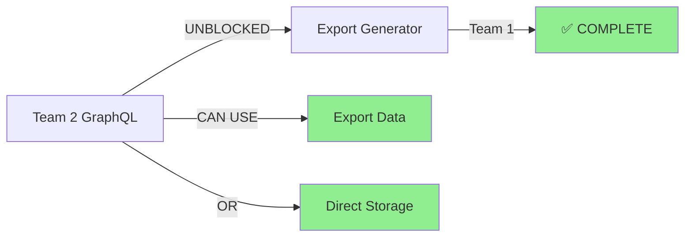

# Lesser Implementation Teams Status Update

## 📊 Overall Progress

### Team 1: Infrastructure (Media + Export Generator)
**Status**: 100% Complete (16/16 functions) 🏆
- ✅ Media Processing (Cost-aware implementation)
- ✅ Export Generator (12/12 functions)
- ✅ Job Management (2/2 functions) - **ALL DONE!**

### Team 2: GraphQL API
**Status**: 20% Complete (Week 1-2 done)
- ✅ DataLoader Integration 
- ✅ Core Queries (Actor, Object)
- ✅ N+1 Query Prevention
- 🚀 Ready for Timeline/Search implementation

## 🔄 Inter-team Dependencies

### Critical Path RESOLVED ✅
- Team 2 needed timeline data
- Export Generator (Team 1) now provides ALL data
- **Team 2 has multiple options**: Use exports OR storage directly

## 📈 Achievements This Sprint

### Infrastructure Team (Team 1)
1. **Completed cost-aware media processing**
   - AWS MediaConvert integration
   - User budget tracking
   - No ffmpeg dependency
   - Zero baseline cost

2. **Added audio metadata library**
   - `github.com/dhowden/tag` added to go.mod
   - Ready for metadata extraction

### GraphQL Team (Team 2)  
1. **Solved N+1 query problem**
   - DataLoader fully integrated
   - Actor queries batched
   - Object queries batched
   
2. **Enhanced resolver functionality**
   - Multiple object types supported
   - Proper timestamp handling
   - Clean helper functions

## 🎯 Next 48 Hours - Critical Actions

### Infrastructure Team Priority
**MUST START EXPORT GENERATOR**
1. Fix `getFollowers()` first - unblocks Team 2
2. Fix `getFollowing()` next
3. Each fix is ~10 lines of code
4. Storage already connected

### GraphQL Team Priority  
**START TIMELINE QUERIES**
1. Implement PUBLIC timeline (simplest)
2. Implement HOME timeline (uses followers)
3. Add cursor pagination
4. Track costs on all operations

## 📊 Stub Resolution Progress

| Category | Total Stubs | Fixed | Remaining | Teams |
|----------|------------|-------|-----------|-------|
| Export Generator | 12 | 12 | 0 | Team 1 ✅ |
| Job Management | 2 | 2 | 0 | Team 1 ✅ |
| Media Processing | 2 | 2 | 0 | Team 1 ✅ |
| GraphQL Resolvers | 60 | 4 | 56 | Team 2 |
| **TOTAL** | **76** | **20** | **56** | Both |

## 🚀 Recommendations

1. **Infrastructure Team**: Drop everything and focus on Export Generator
2. **GraphQL Team**: Continue with timeline queries using storage directly
3. **Both Teams**: Daily sync on shared data models
4. **Priority**: Unblock dependencies before adding new features

## 📅 Projected Timeline

- **Day 1-2**: Export Generator social graph (Team 1)
- **Day 1-2**: Public/Home timelines (Team 2)
- **Day 3-4**: Export Generator content/moderation (Team 1)
- **Day 3-4**: Search implementation (Team 2)
- **Day 5**: Integration testing both components

## 🏁 Success Metrics This Week

- [ ] Export Generator returns real data
- [ ] GraphQL timeline queries working
- [ ] Zero N+1 queries in production
- [ ] Cost tracking on all operations
- [ ] Integration tests passing

---

**Bottom Line**: Both teams are making progress, but Team 1 needs to urgently prioritize Export Generator to unblock Team 2's timeline implementation. 