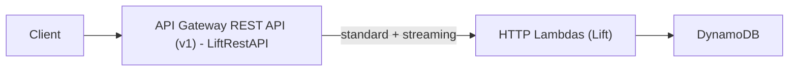

# API Gateway REST API (v1) + Lambda Response Streaming (SSE)

Enable long-lived HTTP response streaming (SSE) in Lesser using the new **API Gateway response streaming** capability (REST API v1 only today), plus Lift’s streaming helpers.

## Implementation Status (current)

- REST API (v1) response streaming is enabled **per-method** for `/api/v1/streaming/*` (mixed buffered + streaming methods are supported).
- `cmd/sse/main.go` implements Mastodon-compatible SSE endpoints using Lift (`lift.SSEResponse`) and is built with `-tags lambda.norpc`.
- Stream-router fans out events to:
  - existing WebSocket connections (unchanged), and
  - an SSE event log (DynamoDB) using **DynamORM only** (no direct DynamoDB client calls).
- Broader Lift adoption tracking lives in `docs/planning/lift-adoption-inventory.md`.
- Instance discovery now returns a canonical streaming host as the **API base URL** (host only, no path), matching Mastodon’s expectations:
  - `cmd/api/lift/misc.go` (`/api/v2/instance` → `configuration.urls.streaming`)
  - `cmd/api/lift/instance.go` (`/api/v1/instance` → `urls.streaming_api`)

Lift already contains useful primitives:
- CDK: `LiftRestAPI` can configure REST API methods to invoke Lambda via `.../response-streaming-invocations` with `ResponseTransferMode=STREAM`.
- Runtime: `lift.SSEResponse` builds a streaming response (an `io.Reader` with content type `application/vnd.awslambda.http-integration-response`).

Note: The canonical Go type for API Gateway REST API response streaming is `events.APIGatewayProxyStreamingResponse` (same wire format/content type). Lift `v1.0.81+` returns `APIGatewayProxyStreamingResponse` for API Gateway v1 triggers (including `MultiValueHeaders`) while keeping non-APIGW streaming behavior unchanged.

---

## Current State (repo)

- Infra:
  - `infra/cdk/constructs/api_routes.go` builds a Lift `LiftRestAPI` (API Gateway REST API v1) for HTTP routes and attaches the custom domain.
  - Response streaming is configured per-method for SSE endpoints only (rewrites integration URI to `/response-streaming-invocations` and sets `ResponseTransferMode=STREAM`).
  - WebSockets are separate API Gateway v2 WebSocket APIs with separate subdomains:
    - Streaming WS: `stream.<api-domain>` (see `infra/cdk/constructs/api_routes.go:createWebSocketApi`).
    - GraphQL WS: `graphql-ws.<api-domain>` (see `infra/cdk/constructs/api_routes.go:createGraphQLWebSocketApi`).
- Lift: `github.com/pay-theory/lift v1.0.81` is pinned in `go.mod`.
- Timeouts:
  - Inventory defaults HTTP Lambdas to `TimeoutSeconds: 30` (`infra/cdk/inventory/types.go`).
  - API Lambda applies a global 30s Lift timeout middleware (`cmd/api/main.go`).
- Existing realtime:
  - Separate WebSocket streaming Lambda exists (`cmd/streaming`) and should remain unchanged unless explicitly replaced.
- Mastodon instance streaming discovery:
  - Mastodon expects `configuration.urls.streaming` / `urls.streaming_api` to be a *host base* (no path) used for `/api/v1/streaming/*` endpoints; Lesser returns the API base URL.
  - WebSockets remain on separate subdomains due to API Gateway restrictions (WebSocket custom domains cannot share a domain with REST/HTTP APIs).
  - SSE uses the API base domain; WebSockets use `stream.<api-domain>` / `graphql-ws.<api-domain>`.

---

## Compatibility Priorities

- **ActivityPub**: no regressions (routing, signature verification, and content negotiation).
- **Mastodon**:
  - REST API compatibility stays a top priority.
  - Streaming: implement Mastodon-compatible **SSE** endpoints (`/api/v1/streaming/*`) using API Gateway response streaming; WebSocket behavior may remain Lesser-specific due to API Gateway constraints.
- **GraphQL parity (definition)**: for every Mastodon-supported capability that is exposed via GraphQL, provide a REST equivalent. Lesser-only “advanced” features may remain GraphQL-only.
- **Authentication (intentional divergence)**: Lesser does not use email/password auth. Client auth is passkeys and crypto wallets; REST endpoints still accept `Authorization: Bearer …` tokens, but the *credential acquisition* flow differs from Mastodon.

---

## Goals / Non-goals

**Goals**
- Support one or more SSE endpoints that can stream up to 15 minutes (AWS max for response streaming).
- Keep existing REST/GraphQL/federation endpoints working under the same domain (unless we explicitly choose a split-domain approach).
- Preserve auth and observability expectations (request IDs, metrics, logs).
- Match the Mastodon streaming **SSE surface** at minimum:
  - Implement `/api/v1/streaming/health` and the timeline endpoints documented by Mastodon.
  - Emit Mastodon event names (`update`, `delete`, `notification`, `status.update`, etc) and payload shapes where feasible.

**Non-goals (for this iteration)**
- Replacing the existing WebSocket streaming API or forcing Mastodon WebSocket protocol compatibility (can be revisited).
- Providing “exactly once” delivery semantics for timeline events without a cursor/history store.

---

## Key Decisions (need to be explicit)

1. **What is “streaming” here?**
   - **A) Finite streaming response**: stream a single timeline/list response as a sequence of SSE events (“items as they serialize”), then close.
   - **B) Continuous realtime stream**: keep the connection open and push new events as they occur (requires a source of events within the invocation: polling, long-poll queue, pubsub, etc).

2. **Public API shape**
   - Mastodon-compatible **SSE** paths/events (e.g. `/api/v1/streaming/*`, `event: update|delete|notification`) vs new Lesser-specific streaming endpoints.
   - Decide how far we go on Mastodon event coverage (announcements, filters, media-only streams, etc).

3. **Domain strategy (base domain + subdomains)**
   - Lesser expects a base domain hosted in Route53 (hosted zone).
   - CDK defines subdomains for:
     - API access (REST + GraphQL): today this is the stage domain (e.g. `{stage}.{rootDomain}`).
     - WebSockets: today this is `stream.{api-domain}` and `graphql-ws.{api-domain}`.
   - Decide where **Mastodon SSE streaming** lives:
     - **Recommended (prototype-friendly)**: serve SSE from the API domain (same host as REST), and keep WebSockets on the existing `stream.*` domain.
     - **Alternative**: create a dedicated SSE streaming subdomain backed by REST API v1 and return that in `configuration.urls.streaming` (avoids full gateway migration but adds new domain + certificate).

4. **Blast radius**
   - **Full gateway migration** (one API, same domain): simplest client story, biggest infra change.
   - **Split gateways** (streaming-only REST API): smaller infra change, but needs a new domain/base-path strategy.

This doc assumes **full gateway migration** unless we choose otherwise.

Important nuance from the AWS feature: response streaming is configured **per method integration**. We should avoid enabling streaming for every route unless we’re prepared to return streaming responses everywhere (or we’ve confirmed API Gateway accepts both buffered proxy responses and streaming responses on the streaming invocation path).

---

## Architecture (target)



---

## Implementation Plan

### Phase 0: Confirm requirements (pre-work)

- Streaming mode: **continuous realtime** streams now (Mastodon-style), not a finite “proof” stream.
- Pick the **endpoint contract** (Decision #2), specifically for Mastodon SSE:
  - **Hostname discovery**:
    - Canonical streaming host: **the API host** (same host that serves `/api/v1/streaming/*`).
    - Ensure `/api/v2/instance` returns a usable `configuration.urls.streaming` base (**no path**).
    - Implement `GET /api/v1/streaming` on the API host to return `404 Not Found` (per Mastodon docs when the same host should be used).
  - **SSE endpoints to implement** (Mastodon surface):
    - `GET /api/v1/streaming/health` → returns plain `OK`.
    - `GET /api/v1/streaming/user`
    - `GET /api/v1/streaming/user/notification`
    - `GET /api/v1/streaming/public` (`only_media` optional)
    - `GET /api/v1/streaming/public/local` (`only_media` optional)
    - `GET /api/v1/streaming/public/remote` (`only_media` optional)
    - `GET /api/v1/streaming/hashtag` (required `tag`)
    - `GET /api/v1/streaming/hashtag/local` (required `tag`)
    - `GET /api/v1/streaming/list` (required `list`)
    - `GET /api/v1/streaming/direct`
  - **Event names + payload rules**:
    - `update` → JSON [Status]
    - `notification` → JSON [Notification]
    - `status.update` → JSON [Status]
    - `delete` → *string ID* on the `data:` line (not a JSON object)
    - `filters_changed` → for SSE we can emit `event: filters_changed` with an empty/ignored payload (Mastodon says “undefined payload” for HTTP connections)
    - (Optional, later): `conversation`, `announcement`, `announcement.reaction`, `announcement.delete`, `notifications_merged`
  - Auth requirements:
    - Public streams require a **user token** (aligns with Mastodon 4.2.0+ and reduces abuse surface).
    - Tokens are still `Authorization: Bearer …`, but acquisition is via passkeys/wallets (not password flows).
  - Reconnect semantics:
    - Decide whether to support `Last-Event-ID` and/or `retry:`; note Lambda streaming hard limit is 15 minutes, so clients must reconnect.
- Decide whether the gateway migration is acceptable (Decision #4):
  - Cost model change (REST API is typically more expensive than HTTP API)
  - Latency and feature parity (throttles, logging, CORS behavior)

### Phase 1: CDK – migrate HTTP ingress to REST API v1

**Primary file(s) impacted**
- `infra/cdk/constructs/api_routes.go`
- `infra/cdk/stacks/lesser_api_stack.go` (outputs and types)

**Work items**
- Replace `awsapigatewayv2.HttpApi` with API Gateway REST API (v1).
- Add a dedicated **SSE Lambda** (e.g. `cmd/sse`) and route `/api/v1/streaming/*` methods to it (other routes continue to target the existing `api`/`graphql` Lambdas).
- Decide how to apply response streaming:
  - **Preferred**: enable streaming only on the SSE endpoints (per-method overrides).
  - **Alternative**: use `LiftRestAPI` with `EnableStreaming=true` (enables streaming integration on all methods added via the construct).
  - If we take the alternative, validate early that non-streaming handlers still produce a valid response under `.../response-streaming-invocations`.
- Example (streaming only for one method):
  ```go
  timeoutSeconds := 15 * 60
  api := liftconstructs.NewLiftRestAPI(scope, jsii.String("RestAPI"), &liftconstructs.LiftRestAPIProps{
  	APICommonProps: liftconstructs.APICommonProps{
  		Name: jsii.String("lesser-api"),
  	},
  	EnableStreaming:  jsii.Bool(false), // default buffered
  	StreamingTimeout: &timeoutSeconds,  // used by streaming-enabled methods
  })

  api.AddLambdaIntegrationWithOptions(
  	jsii.String("/api/v1/streaming/health"),
  	jsii.String("GET"),
  	apiFn,
  	&liftconstructs.IntegrationOptions{
  		EnableStreaming:        jsii.Bool(true),
  		StreamingTimeoutSeconds: jsii.Int(900),
  	},
  )
  ```
- If using `LiftRestAPI` for streaming methods:
  - Set `StreamingTimeout=900` (15 minutes).
  - Set `StageName` explicitly (use `props.Environment` unless we want `prod`).
  - Enable access logging and CORS (verify headers required by web clients).
- Rewire routing:
  - Port the existing route list to `LiftRestAPI.AddLambdaIntegration(...)`.
  - Ensure greedy proxy routes (e.g. `ANY /{proxy+}`) do not shadow more specific federation routes; verify precedence with API Gateway REST routing rules.
- Custom domain + DNS:
  - Ensure REST API domain mapping is equivalent to the current HTTP API domain mapping.
  - Preserve Route53 A/AAAA alias records if they were previously created here.

**Compatibility checklist**
- Verify the Lift CORS header allowlist includes what browsers will need for SSE:
  - `Authorization`
  - `Last-Event-ID` (if we plan to support reconnection)
  - any custom headers we require (request id, tenant id, etc)
- Ensure access logging format and log group names still meet ops expectations.

### Phase 2: Build – compile streaming Lambdas with `lambda.norpc`

AWS Lambda response streaming for Go requires compiling with `-tags lambda.norpc` (Lift’s `SSEResponse` also documents this requirement).

**Scope (chosen)**
- Only the dedicated SSE Lambda needs `-tags lambda.norpc` (other Lambdas can keep their existing build settings).

**Makefile updates**
- Add `-tags lambda.norpc` to `make build-lambdas`, `build-%`, and `build-local` at minimum.

### Phase 3: Timeouts – streaming routes must allow 15 minutes

Response streaming requires 3 independent timeouts to be aligned:

- **API Gateway integration timeout**: `StreamingTimeout` (up to 900s).
- **Lambda function timeout**: must be ≥ integration timeout for endpoints that keep the connection open.
  - SSE is isolated into a dedicated Lambda: set `TimeoutSeconds: 900` for the SSE Lambda only.
- **Application middleware timeout**: ensure the SSE Lambda does not apply a 30s global timeout middleware.

### Phase 4: Add SSE endpoints (Lift handlers)

Start with a minimal endpoint to validate infra + build tags before adding business-critical streams.

**Recommended sequence**
1. `GET /api/v1/streaming/health` (public)
   - Return `OK` immediately (Mastodon-compatible), then (optionally) also support a `?stream=true` dev-only mode that emits heartbeats to validate response streaming.
   - Confirms: gateway integration works, headers are correct, client receives incremental chunks.
2. Timeline streaming endpoints (auth)
   - Implement Mastodon endpoints listed in Phase 0.
   - Reuse existing Mastodon payload conversion logic so SSE payloads match the normal REST endpoints.

**Implementation approach for continuous streaming (chosen)**
- Build a **native SSE fanout path** backed by a shared event source (not by bridging through the existing WebSocket streaming API).
- Practical constraint: an SSE connection is tied to a single Lambda invocation; other invocations cannot “push” into it. Therefore the SSE Lambda must either:
  - poll a shared store for new events (simplest, prototype-friendly), or
  - maintain a subscription to shared pubsub (Redis/NATS/etc; more infra, lower latency).
- Recommended first implementation: extend the existing stream-router fanout logic to also persist each `{stream,event,payload}` into a DynamoDB-backed “stream event log” (TTL, ordered), and have the SSE Lambda poll that log and emit SSE frames.

**SSE contract details to specify**
- Headers: `Content-Type: text/event-stream`, `Cache-Control: no-cache`, `Connection: keep-alive`.
- Heartbeat: send periodic comments (e.g. `:thump`) or events to avoid idle disconnects.
- Event IDs: if we support reconnection, set `id:` and accept `Last-Event-ID`.
- Error model:
  - If auth/validation fails, return a normal JSON error response **before** starting streaming.
  - Once streaming begins, emit `event: error` and close.

### Phase 5: Observability + safety limits

- Metrics to add (per environment):
  - Active SSE connections (approx: concurrency)
  - Connection duration
  - Bytes sent / events sent
  - Error reasons (client disconnect vs server)
- API Gateway streaming access log fields to adopt (if we rely on access logs for SLOs):
  - `$content.integration.responseTransferMode` (BUFFERED vs STREAMED)
  - `$context.integration.timeToAllHeaders`
  - `$context.integration.timeToFirstContent`
- Limits:
  - Rate limit new SSE connections per IP/user.
  - Cap concurrent connections per user to prevent runaway cost.
  - Consider a hard upper bound on streaming duration (e.g., 5–15m) + client reconnection strategy.

### Phase 6: Verification + rollout

**Dev verification**
```bash
curl -N -H "Accept: text/event-stream" \
  -H "Authorization: Bearer {token}" \
  "https://{domain}/api/v1/streaming/health"
```

**Regression checklist**
- Confirm key REST endpoints still work (e.g. `/api/v1/instance`, `/api/v1/accounts/verify_credentials`).
- Confirm federation endpoints still work (e.g. `/users/{username}`, `/inbox`).
- Confirm GraphQL routes still function (unchanged, but still behind the same domain).

**Rollout**
- Deploy to `dev` first.
- Keep a rollback path (restore HTTP API v2) until streaming endpoints are proven stable.

---

## Platform Constraints (API Gateway Response Streaming)

These are AWS platform behaviors/limits (not Lift behaviors) and should shape the endpoint contract:

- **Max integration timeout**: 15 minutes.
- **Idle timeouts**:
  - Regional + Private endpoints: 5 minutes idle timeout.
  - Edge-optimized endpoints: 30 seconds idle timeout.
  - Implication: send heartbeats more frequently than the idle timeout (e.g. every 15–30s).
- **Bandwidth throttling**: first 10 MB is unrestricted; payload beyond 10 MB is throttled to 2 MB/s.
- **Unsupported with streaming responses**: VTL response transformation, integration response caching, and content encoding.
- **Billing model**: response payload is billed in 10 MB increments (rounded up) per request (per AWS pricing notes).

## Decisions (resolved)

- **Streaming mode**: continuous realtime streams now (Mastodon-style).
- **Canonical streaming host**: the API host (same host that serves `/api/v1/streaming/*`).
  - Set `configuration.urls.streaming` to the API host base (no path).
  - `GET /api/v1/streaming` returns `404 Not Found` on the API host.
- **Auth**: public streams require a user token (aligns with Mastodon 4.2.0+ and reduces abuse).
- **`only_media`**: implement immediately for the applicable endpoints.
- **Implementation**: native SSE fanout path (not a WS bridge).
- **Deployment**: SSE is isolated into a dedicated Lambda.
- **Streaming enablement scope**: enable response streaming only on `/api/v1/streaming/*` methods (per-method integration overrides).
