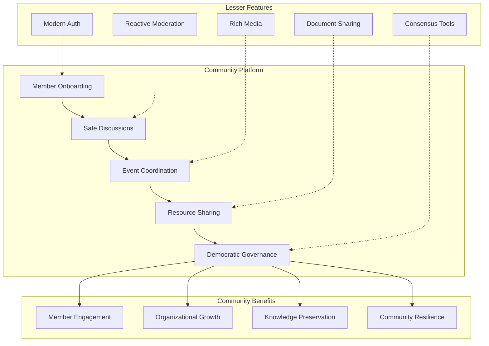
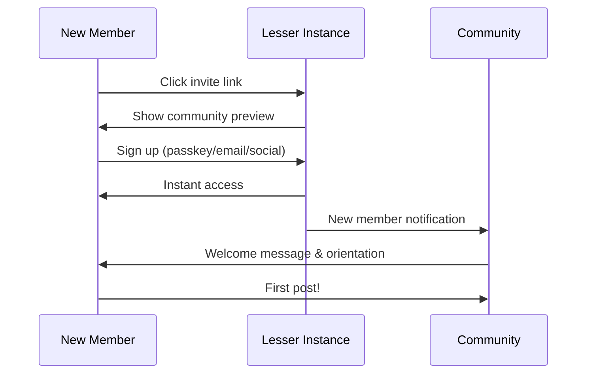

# Lesser for Community Organizations: Empowering Digital Communities

## Executive Summary

Lesser revolutionizes how community organizations build and maintain their digital presence. At just $0.01-0.05 per member per month, organizations can have their own social platform with complete control, modern features, and zero technical maintenance. From neighborhood associations to global advocacy groups, Lesser makes professional community infrastructure accessible to all.

**Key Value**: A 500-member community organization pays ~$25/month instead of $500-2,000/month for traditional solutions, while gaining superior features and complete data ownership.

## Why Lesser for Communities?

### 1. The Community Organization Challenge

Traditional options force communities to choose between:

**Corporate Social Media**:
- ❌ No control over algorithms or policies
- ❌ Data harvesting and privacy concerns  
- ❌ Ads and distractions
- ❌ Platform changes can destroy communities
- ❌ No real ownership

**Self-Hosted Solutions**:
- ❌ $500-2,000/month for servers
- ❌ Requires technical expertise
- ❌ Maintenance headaches
- ❌ Security responsibilities
- ❌ Scaling challenges

**Lesser's Solution**:
- ✅ **Own your community** at domain.org
- ✅ **Costs less than coffee** for most members
- ✅ **Zero maintenance** - serverless architecture
- ✅ **Professional features** without the complexity
- ✅ **Complete control** over your space

### 2. Built for Community Needs



## Use Cases by Organization Type

### 1. Neighborhood & Local Communities

**Park Slope Parents (Brooklyn, NY)**
- **Members**: 5,000 families
- **Current Cost**: $800/month (Facebook Groups + Newsletter service)
- **Lesser Cost**: $250/month
- **Savings**: $6,600/year

**Features Used**:
```yaml
community:
  name: "Park Slope Parents"
  domain: "parkslopeparents.org"
  
  features:
    - local_business_directory
    - event_calendar
    - classified_ads
    - emergency_alerts
    - recommendation_engine
    
  moderation:
    type: "reactive_mesh"
    trusted_moderators: 20
    community_guidelines: true
    
  privacy:
    default_visibility: "members_only"
    verification_required: true
    location_verification: "11215, 11217"
```

**Real Benefits**:
- **No more Facebook**: Own platform with no ads or data mining
- **Local focus**: Verify members live in neighborhood
- **Resource sharing**: Built-in classifieds and recommendations
- **Emergency comms**: Instant alerts for community issues
- **Historical record**: Preserve community knowledge

### 2. Professional Associations

**Independent Designers Alliance**
- **Members**: 2,000 designers globally
- **Current Cost**: $1,500/month (Slack + Forum + Website)
- **Lesser Cost**: $100/month
- **Savings**: $16,800/year

**Implementation**:
```python
# Professional community features
class ProfessionalCommunity:
    def __init__(self):
        self.features = {
            'job_board': self.create_job_board(),
            'portfolio_showcase': self.setup_portfolios(),
            'mentorship_matching': self.match_mentors(),
            'resource_library': self.organize_resources(),
            'chapter_federation': self.connect_chapters()
        }
    
    def create_job_board(self):
        """Integrated job posting system"""
        return {
            'post_types': ['full_time', 'freelance', 'internship'],
            'verification': 'wallet_or_passkey_required',
            'visibility': 'members_only',
            'application_tracking': True
        }
    
    def setup_portfolios(self):
        """Member showcase features"""
        return {
            'media_gallery': True,
            'project_descriptions': True,
            'client_testimonials': True,
            'skill_tags': True,
            'hire_me_button': True
        }
```

### 3. Advocacy & Activist Groups

**Climate Action Network**
- **Members**: 10,000 activists
- **Current Cost**: $2,000/month (Various tools)
- **Lesser Cost**: $500/month
- **Savings**: $18,000/year

**Unique Requirements**:
```yaml
advocacy_features:
  security:
    - end_to_end_encryption: "for sensitive planning"
    - anonymous_posting: "whistleblower protection"
    - rapid_account_deletion: "activist safety"
    
  organizing:
    - event_coordination: "protests, meetings"
    - resource_distribution: "materials, guides"
    - chapter_federation: "local to global"
    - multi_language: "inclusive organizing"
    
  campaigns:
    - petition_system: "integrated signatures"
    - action_alerts: "urgent mobilization"
    - media_kit_sharing: "press resources"
    - impact_tracking: "measure success"
```

### 4. Support Groups

**Chronic Illness Warriors**
- **Members**: 1,000 individuals
- **Current Cost**: $400/month (Forum + Chat)
- **Lesser Cost**: $50/month
- **Savings**: $4,200/year

**Safety Features**:
```python
class SupportGroupFeatures:
    def __init__(self):
        self.privacy_controls = {
            'anonymous_mode': True,
            'trigger_warnings': True,
            'content_filters': self.health_appropriate_filters(),
            'crisis_resources': self.emergency_contacts()
        }
    
    def health_appropriate_filters(self):
        """Filters for medical misinformation"""
        return {
            'flag_medical_advice': True,
            'require_disclaimers': True,
            'verified_professionals': 'special_badge',
            'resource_verification': 'moderator_approved'
        }
    
    def emergency_contacts(self):
        """Crisis intervention integration"""
        return {
            'crisis_hotlines': 'prominently_displayed',
            'auto_detection': 'crisis_keywords',
            'immediate_resources': True,
            'professional_referrals': 'directory'
        }
```

### 5. Hobby & Interest Groups

**Urban Sketchers Seattle**
- **Members**: 300 artists
- **Current Cost**: $150/month (Various platforms)
- **Lesser Cost**: $15/month
- **Savings**: $1,620/year

**Creative Community Features**:
```yaml
creative_features:
  galleries:
    - member_portfolios: "individual galleries"
    - group_exhibitions: "curated shows"
    - work_in_progress: "share process"
    - critique_system: "constructive feedback"
    
  events:
    - sketch_crawls: "location-based events"
    - virtual_sessions: "online drawing"
    - workshops: "skill sharing"
    - annual_exhibition: "showcase work"
    
  resources:
    - technique_library: "tutorials"
    - supply_recommendations: "community-tested"
    - location_database: "sketch spots"
    - inspiration_feed: "daily prompts"
```

### 6. Educational Communities

**Homeschool Co-op Network**
- **Members**: 200 families
- **Current Cost**: $300/month (Multiple tools)
- **Lesser Cost**: $10/month
- **Savings**: $3,480/year

**Educational Features**:
```python
class EducationalCommunity:
    def setup_learning_environment(self):
        return {
            'resource_library': {
                'curriculum_sharing': True,
                'lesson_plans': 'categorized',
                'educational_links': 'curated',
                'book_recommendations': 'age_grouped'
            },
            'scheduling': {
                'class_calendar': True,
                'field_trips': 'rsvp_system',
                'teacher_availability': True,
                'room_booking': 'integrated'
            },
            'progress_tracking': {
                'private_journals': 'parent_controlled',
                'milestone_sharing': 'opt_in',
                'portfolio_building': True
            }
        }
```

## Implementation Guide

### 1. Quick Start for Communities

```bash
# 1. Deploy your community instance (15 minutes)
git clone https://github.com/lesser/community-template
cd community-template

# 2. Configure your community
cp community.example.yaml community.yaml
# Edit with your community details

# 3. Deploy
cd infra
pulumi up -y

# 4. Import existing members (optional)
python scripts/import_members.py --source csv --file members.csv

# 5. Launch!
python scripts/send_invitations.py
```

### 2. Migration Strategies

**From Facebook Groups**:
```python
# Facebook Group Migration Tool
class FacebookMigration:
    def migrate_group(self, group_export):
        """Convert Facebook export to Lesser"""
        return {
            'members': self.import_members(group_export['members']),
            'posts': self.convert_posts(group_export['posts']),
            'media': self.download_media(group_export['photos']),
            'events': self.import_events(group_export['events'])
        }
    
    def preserve_engagement(self, post):
        """Keep important engagement data"""
        return {
            'original_likes': post['reaction_count'],
            'original_comments': len(post['comments']),
            'original_date': post['created_time'],
            'import_note': 'Imported from Facebook'
        }
```

**From Slack**:
```yaml
slack_migration:
  channels_to_categories:
    general: "announcements"
    random: "water_cooler"
    projects: "collaborations"
    
  features_mapping:
    threads: "nested_replies"
    reactions: "emoji_reactions"
    pins: "pinned_posts"
    files: "media_attachments"
```

### 3. Community Governance Models

**Democratic Model**:
```yaml
governance:
  type: "democratic"
  
  roles:
    members: "propose and vote"
    moderators: "elected annually"
    admins: "founding team"
    
  decisions:
    rule_changes: "majority_vote"
    moderator_election: "ranked_choice"
    feature_requests: "community_poll"
    budget_allocation: "transparent_vote"
    
  tools:
    polls: "built_in"
    proposals: "structured_format"
    discussions: "time_limited"
    results: "public_record"
```

**Trust-Based Model**:
```python
class TrustGovernance:
    def __init__(self):
        self.trust_levels = {
            'new_member': {'days': 0, 'posts': 0},
            'active_member': {'days': 30, 'posts': 10},
            'trusted_member': {'days': 90, 'posts': 50},
            'core_member': {'days': 365, 'posts': 200}
        }
    
    def calculate_voting_weight(self, member):
        """Trust-weighted voting"""
        base_weight = 1.0
        trust_multiplier = self.get_trust_multiplier(member)
        participation_bonus = self.get_participation_bonus(member)
        
        return base_weight * trust_multiplier * participation_bonus
```

## Features Deep Dive

### 1. Modern Member Onboarding

**Zero-Friction Join Process**:


**Benefits**:
- **No passwords needed** with passkeys
- **Instant access** - no approval delays
- **Mobile-friendly** - join from any device
- **Social login** - use existing accounts
- **Custom welcome** - community-specific onboarding

### 2. Reactive Moderation Mesh

**Community Self-Governance**:
```python
# How communities moderate themselves
class CommunityModeration:
    def __init__(self, community_values):
        self.values = community_values
        self.trust_threshold = 0.7
        
    def handle_flag(self, content, flag_reason):
        """Community-driven moderation"""
        # Get trusted members to review
        reviewers = self.select_reviewers(
            count=5,
            criteria='high_trust_score',
            exclude=content.author
        )
        
        # Collect weighted opinions
        reviews = self.collect_reviews(reviewers, content)
        
        # Calculate consensus
        decision = self.calculate_consensus(reviews)
        
        # Apply decision with transparency
        return self.apply_decision(decision, public_record=True)
```

### 3. Rich Communication Tools

**Beyond Text Posts**:
```yaml
communication_features:
  post_types:
    - announcements: "official_badge"
    - discussions: "threaded_replies"
    - polls: "multiple_choice"
    - events: "rsvp_system"
    - resources: "file_attachments"
    
  media_support:
    - images: "galleries"
    - videos: "streaming_capable"
    - documents: "pdf_preview"
    - audio: "podcast_player"
    
  real_time:
    - live_updates: "websocket"
    - typing_indicators: "optional"
    - presence: "who_is_online"
    - notifications: "customizable"
```

### 4. Event Management

**Built-in Event System**:
```python
class CommunityEvents:
    def create_event(self, details):
        return {
            'basics': {
                'title': details.title,
                'date': details.date,
                'location': details.location or 'virtual',
                'capacity': details.max_attendees
            },
            'features': {
                'rsvp_tracking': True,
                'waitlist': True,
                'reminders': 'automated',
                'calendar_sync': 'ics_export',
                'virtual_link': details.meeting_url
            },
            'engagement': {
                'pre_event_discussion': True,
                'live_thread': True,
                'post_event_photos': True,
                'feedback_survey': 'automatic'
            }
        }
```

### 5. Knowledge Management

**Institutional Memory**:
```yaml
knowledge_features:
  organization:
    - pinned_resources: "important_info"
    - community_wiki: "collaborative"
    - faq_system: "searchable"
    - document_library: "categorized"
    
  preservation:
    - full_text_search: "all_content"
    - annual_archives: "downloadable"
    - highlight_reels: "best_of"
    - member_stories: "testimonials"
    
  discovery:
    - ai_search: "semantic"
    - recommendations: "personalized"
    - trending_topics: "community_specific"
    - expert_directory: "skill_based"
```

## Cost Analysis

### Small Community (50 members)
```
Monthly Costs:
- Infrastructure: $2.50
- Media storage: ~$5
- Total: ~$7.50/month

Annual: ~$90
Per member: $0.15/month
```

### Medium Community (500 members)
```
Monthly Costs:
- Infrastructure: $25
- Media storage: ~$20
- AI features: ~$5
- Total: ~$50/month

Annual: ~$600
Per member: $0.10/month
```

### Large Community (5,000 members)
```
Monthly Costs:
- Infrastructure: $250
- Media storage: ~$100
- AI features: ~$50
- Total: ~$400/month

Annual: ~$4,800
Per member: $0.08/month
```

### Cost Comparison
| Platform | 500 Members | 5,000 Members | Features |
|----------|-------------|---------------|----------|
| Discord | Free* | Free* | Limited, ads coming |
| Slack | $3,500/mo | $35,000/mo | Not community-focused |
| Circle | $99/mo | $399/mo | Limited customization |
| Discourse | $100/mo | $300/mo | Forum-only |
| **Lesser** | **$50/mo** | **$400/mo** | **Full featured** |

*Free but you don't own your data or platform

## Success Stories

### "We Own Our Community Now"
> "After Facebook changed their groups algorithm, we lost 80% of our engagement overnight. With Lesser, we control our destiny. Our members love having a dedicated space without ads or distractions."
> 
> — Sarah Chen, Park Slope Parents (5,000 members)

### "Finally Affordable"
> "We're a volunteer-run organization. Paying $500/month for hosting was killing us. Lesser costs us $25/month and works better than our old setup. It's been transformative."
> 
> — Marcus Johnson, Community Garden Network (400 members)

### "Privacy That Matters"
> "Our support group needs real privacy. With Lesser, we know our members' stories stay within our community. No data mining, no ads targeting vulnerable people."
> 
> — Dr. Amanda Williams, Chronic Pain Support (1,000 members)

## Getting Started Checklist

### Week 1: Planning
- [ ] Define community purpose and values
- [ ] Identify key features needed
- [ ] Set up governance structure
- [ ] Plan migration strategy

### Week 2: Setup
- [ ] Deploy Lesser instance
- [ ] Configure community settings
- [ ] Customize appearance
- [ ] Import existing members

### Week 3: Soft Launch
- [ ] Invite core team
- [ ] Test all features
- [ ] Create initial content
- [ ] Refine onboarding

### Week 4: Full Launch
- [ ] Send invitations
- [ ] Host welcome event
- [ ] Monitor engagement
- [ ] Gather feedback

## Support Resources

### For Community Managers
- Video tutorials for all features
- Community management best practices
- Monthly webinars with other communities
- Direct support channel

### For Members
- Easy onboarding guides
- Feature discovery tips
- Mobile app instructions
- Accessibility documentation

### Technical Help
- Migration assistance
- Custom feature development
- Integration support
- Performance optimization

## The Lesser Advantage

### 1. **True Ownership**
Your community, your rules, your data. No platform can shut you down or change the rules.

### 2. **Sustainable Costs**
Pay what it actually costs to run. No investor profits, no inflated pricing.

### 3. **Modern Experience**
Better than corporate social media, easier than forums, more focused than chat apps.

### 4. **Community-First Design**
Every feature designed for community building, not advertising or engagement metrics.

### 5. **Future-Proof**
Open source, standards-based, federated. Your community can outlive any company.

## Conclusion

Lesser transforms how communities organize online. By removing the barriers of cost, complexity, and control, we enable communities to focus on what matters: their members and their mission.

Whether you're a neighborhood group tired of Facebook, a professional association outgrowing Slack, or an advocacy organization needing secure communications, Lesser provides the infrastructure you need at a price you can afford.

Your community deserves better than renting space on someone else's platform. With Lesser, you can own your digital community home.

---

**Ready to empower your community?** Deploy your Lesser instance today and join the thousands of communities taking control of their digital future.

Contact: communities@lesser.social | [Community Portal](https://communities.lesser.social) 