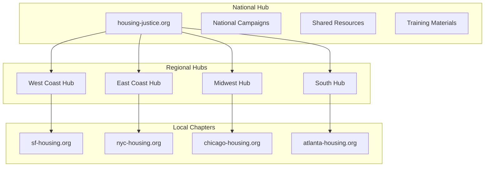

# Lesser Community Scenarios: Real-World Implementation Templates

## Overview

This document provides detailed implementation scenarios for various community organizations using Lesser. Each scenario includes setup guides, configuration templates, migration strategies, and success metrics tailored to specific community types.

## Scenario 1: Neighborhood Association Digital Transformation

### Community Profile
**Organization**: Riverside Heights Neighborhood Association  
**Location**: Portland, OR  
**Members**: 750 households  
**Current State**: Facebook Group + Email list  
**Pain Points**: Lost 60% engagement after FB algorithm changes, privacy concerns, no ownership

### Implementation Plan

**Phase 1: Setup & Migration (Week 1-2)**
```yaml
# riverside-config.yaml
instance:
  name: "Riverside Heights Community"
  domain: "riverside-heights.org"
  
authentication:
  methods:
    - email
    - social_login
    - passkeys
  verification:
    type: "address_verification"
    zip_codes: ["97201", "97209"]
    
initial_categories:
  - name: "Announcements"
    permissions: "moderators_only"
  - name: "Buy/Sell/Trade"
    permissions: "verified_members"
  - name: "Local Business"
    permissions: "all_members"
  - name: "Safety Alerts"
    permissions: "trusted_members"
  - name: "Events"
    permissions: "all_members"
```

**Migration Script**:
```python
# migrate_from_facebook.py
import lesser
from facebook_export import FacebookGroupExporter

class RiversideMigration:
    def __init__(self):
        self.fb_group_id = "riverside-heights-group"
        self.lesser_instance = lesser.connect("riverside-heights.org")
        
    def migrate_members(self):
        """Import members with verification"""
        fb_members = FacebookGroupExporter.get_members(self.fb_group_id)
        
        for member in fb_members:
            # Create invitation with pre-filled data
            self.lesser_instance.create_invitation({
                'email': member.email,
                'name': member.name,
                'pre_verified': member.admin_approved,
                'import_note': f"Member since {member.join_date}",
                'initial_trust': self.calculate_initial_trust(member)
            })
    
    def migrate_content(self):
        """Selectively import valuable content"""
        posts = FacebookGroupExporter.get_posts(
            self.fb_group_id,
            filter={
                'min_engagement': 10,  # Skip low-value posts
                'has_comments': True,
                'date_range': 'last_year'
            }
        )
        
        for post in posts:
            if self.is_valuable_content(post):
                self.lesser_instance.import_post({
                    'author': post.author_email,
                    'content': post.text,
                    'media': self.download_media(post.attachments),
                    'original_date': post.created_at,
                    'import_tag': 'facebook_archive',
                    'engagement_note': f"{post.likes} likes, {post.comments} comments on Facebook"
                })
```

**Phase 2: Feature Activation (Week 3)**
```javascript
// Custom features for neighborhood needs
const RiversideFeatures = {
    // Local business directory
    businessDirectory: {
        enabled: true,
        categories: ['restaurants', 'services', 'retail', 'healthcare'],
        verification: 'business_license',
        features: ['reviews', 'hours', 'contact', 'special_offers']
    },
    
    // Neighborhood watch integration
    safetyAlerts: {
        enabled: true,
        types: ['suspicious_activity', 'found_pet', 'weather_alert', 'traffic'],
        notifications: {
            urgent: 'push_and_email',
            standard: 'in_app'
        },
        mapping: true  // Show on neighborhood map
    },
    
    // Community resources
    sharedResources: {
        tool_library: true,
        skill_sharing: true,
        babysitter_list: true,
        trusted_vendors: true
    }
};
```

**Phase 3: Launch & Adoption (Week 4)**
```yaml
launch_strategy:
  soft_launch:
    - board_members: "Day 1"
    - active_volunteers: "Day 3"
    - feedback_collection: "Days 1-7"
    
  marketing:
    - yard_signs: "QR codes to join"
    - newsletter: "Migration announcement"
    - coffee_mornings: "Tech help sessions"
    
  incentives:
    - early_adopter_badge: "First 100 members"
    - profile_completion: "Neighborhood map inclusion"
    - first_post: "Welcome package"
```

### Success Metrics
```python
# Track adoption and engagement
class CommunityMetrics:
    def monthly_report(self):
        return {
            'adoption': {
                'total_members': 580,  # 77% of households
                'active_weekly': 420,  # 72% active
                'growth_rate': '+15%'
            },
            'engagement': {
                'posts_per_day': 25,
                'comments_per_post': 8.5,
                'event_attendance': 85
            },
            'value_created': {
                'items_traded': 145,
                'services_exchanged': 67,
                'local_business_referrals': 234
            },
            'cost_savings': {
                'previous_cost': 150,  # FB ads + Mailchimp
                'lesser_cost': 38,
                'monthly_savings': 112
            }
        }
```

## Scenario 2: Professional Association Modernization

### Community Profile
**Organization**: State Physical Therapy Association  
**Members**: 3,200 professionals  
**Current Tools**: Listserv + Annual conference + Static website  
**Goals**: Year-round engagement, continuing education, job board

### Implementation Architecture

**Multi-Tier Member System**:
```python
class ProfessionalMembership:
    tiers = {
        'student': {
            'cost': 0,  # Free tier
            'features': ['job_board_view', 'educational_content', 'mentorship_requests'],
            'verification': 'student_id'
        },
        'professional': {
            'cost': 0.05,  # $0.05/month via Lesser
            'features': ['full_access', 'ce_credits', 'directory_listing', 'job_posting'],
            'verification': 'license_number'
        },
        'clinic_owner': {
            'cost': 0.10,  # Premium features
            'features': ['bulk_job_posts', 'featured_listings', 'analytics', 'api_access'],
            'verification': 'business_license'
        }
    }
    
    def setup_continuing_education(self):
        return {
            'course_hosting': True,
            'credit_tracking': True,
            'certificate_generation': True,
            'state_reporting': 'automated',
            'peer_review': True
        }
```

**Integrated Job Board**:
```javascript
// Professional job board with Lesser
const JobBoardConfig = {
    posting: {
        fields: [
            'title', 'location', 'salary_range', 'experience_required',
            'specialization', 'benefits', 'remote_options'
        ],
        verification: 'employer_verification',
        duration: 30, // days
        promotion: {
            featured: true,
            newsletter: true,
            alerts: 'matching_members'
        }
    },
    
    matching: {
        algorithm: 'skill_and_location',
        notifications: 'daily_digest',
        application: 'in_platform',
        analytics: {
            views: true,
            applications: true,
            conversion: true
        }
    },
    
    revenue: {
        standard_post: 0,  // Free for members
        featured_post: 50, // Revenue to association
        bulk_package: 200  // 5 posts
    }
};
```

**Chapter Federation**:
```yaml
federation_structure:
  national:
    domain: "ptassociation.org"
    role: "content_aggregator"
    
  state_chapters:
    - domain: "california.ptassociation.org"
      members: 450
      autonomy: "high"
    - domain: "texas.ptassociation.org"  
      members: 380
      autonomy: "high"
      
  content_sharing:
    ce_courses: "federated"
    job_posts: "opt_in_federation"
    best_practices: "public_federation"
    
  governance:
    national_policies: "inherited"
    local_rules: "chapter_specific"
    voting: "proportional_representation"
```

### Migration Strategy
```python
# Migrate from legacy systems
class LegacyMigration:
    def __init__(self):
        self.sources = {
            'member_database': 'mysql://legacy_db',
            'listserv_archives': '/archives/ptlist',
            'website_content': 'https://oldsite.org'
        }
    
    def migrate_members(self):
        """Import with professional verification"""
        members = self.get_legacy_members()
        
        for member in members:
            profile = {
                'email': member.email,
                'license': member.pt_license,
                'specializations': member.certifications,
                'practice_location': member.clinic,
                'member_since': member.join_date,
                'ce_credits': self.import_ce_history(member.id)
            }
            
            # Auto-verify based on license
            if self.verify_license(member.pt_license):
                profile['verified'] = True
                profile['trust_score'] = 0.8
            
            self.lesser.create_member(profile)
    
    def preserve_knowledge(self):
        """Convert listserv archives to searchable knowledge base"""
        threads = self.parse_listserv_archives()
        
        valuable_threads = [t for t in threads if t.replies > 5]
        
        for thread in valuable_threads:
            self.lesser.import_discussion({
                'title': thread.subject,
                'category': self.categorize_thread(thread),
                'posts': thread.messages,
                'tags': self.extract_medical_terms(thread),
                'searchable': True,
                'ai_summary': self.generate_summary(thread)
            })
```

### Success Outcomes
- **Member Engagement**: 78% weekly active (up from 12% on listserv)
- **CE Completion**: 3.2x increase in continuing education participation  
- **Job Placements**: 450 successful placements in first year
- **Cost Reduction**: $24,000/year saved vs. previous tools
- **Revenue Generation**: $18,000/year from job board featured posts

## Scenario 3: Multi-Chapter Advocacy Organization

### Community Profile
**Organization**: National Housing Justice Coalition  
**Structure**: 50 local chapters across US  
**Members**: 25,000 advocates and allies  
**Mission**: Affordable housing advocacy  
**Challenge**: Coordinate national campaigns while supporting local autonomy

### Federated Architecture

**Hub and Spoke Model**:


**Configuration for Multi-Level Organizing**:
```python
class AdvocacyFederation:
    def __init__(self):
        self.levels = {
            'national': {
                'domain': 'housing-justice.org',
                'role': 'campaign_coordinator',
                'features': ['broadcast', 'resource_library', 'training_hub'],
                'permissions': {
                    'create_campaigns': True,
                    'mandate_content': False,  # Respect local autonomy
                    'aggregate_data': True
                }
            },
            'regional': {
                'role': 'coordination_hub',
                'features': ['regional_campaigns', 'resource_sharing', 'cross_chapter'],
                'permissions': {
                    'create_regional_campaigns': True,
                    'moderate_content': True,
                    'allocate_resources': True
                }
            },
            'local': {
                'role': 'ground_operations',
                'features': ['local_events', 'member_organizing', 'direct_action'],
                'permissions': {
                    'full_autonomy': True,
                    'opt_in_campaigns': True,
                    'local_fundraising': True
                }
            }
        }
    
    def campaign_coordination(self, campaign_type):
        if campaign_type == 'national':
            return {
                'messaging': 'unified_talking_points',
                'materials': 'centrally_created',
                'timeline': 'synchronized',
                'reporting': 'aggregated',
                'local_adaptation': 'encouraged'
            }
        elif campaign_type == 'local':
            return {
                'messaging': 'locally_determined',
                'materials': 'locally_created',
                'timeline': 'flexible',
                'reporting': 'optional_sharing',
                'amplification': 'federation_network'
            }
```

**Security for Sensitive Organizing**:
```yaml
security_features:
  encryption:
    - direct_messages: "end_to_end"
    - sensitive_posts: "encrypted_categories"
    - planning_docs: "encrypted_storage"
    
  privacy:
    - anonymous_mode: "available"
    - quick_deletion: "user_controlled"
    - data_retention: "30_days_max"
    
  access_control:
    - verification: "chapter_vouching"
    - compartmentalization: "need_to_know"
    - audit_logs: "encrypted"
    
  rapid_response:
    - account_freeze: "user_triggered"
    - data_export: "instant"
    - burn_notice: "emergency_deletion"
```

**Campaign Tools Integration**:
```javascript
const CampaignTools = {
    petition: {
        creation: 'template_based',
        signatures: {
            collection: 'integrated',
            verification: 'passkey_or_wallet',
            privacy: 'gdpr_compliant',
            export: 'government_format'
        },
        promotion: {
            social_share: true,
            qr_codes: true,
            embed_widget: true
        }
    },
    
    phoneBank: {
        integration: 'voip_system',
        scripts: 'dynamic_generation',
        tracking: 'call_outcomes',
        scheduling: 'volunteer_slots'
    },
    
    eventOrganizing: {
        types: ['protest', 'townhall', 'training', 'fundraiser'],
        rsvp: 'capacity_management',
        materials: 'auto_generate',
        legal: 'permit_tracking',
        safety: 'legal_observer_coordination'
    },
    
    impactTracking: {
        metrics: ['participants', 'media_mentions', 'policy_changes'],
        reporting: 'automated_dashboards',
        storytelling: 'impact_narratives'
    }
};
```

### Implementation Timeline

**Phase 1: National Infrastructure (Month 1)**
- Deploy national hub
- Set up resource library
- Create campaign templates
- Establish security protocols

**Phase 2: Regional Rollout (Month 2)**
- Deploy 4 regional hubs
- Train regional coordinators
- Test federation features
- Refine permissions model

**Phase 3: Local Chapter Migration (Months 3-6)**
```python
# Staged chapter migration
migration_waves = {
    'wave_1': {
        'chapters': 10,
        'criteria': 'most_active',
        'support': 'high_touch',
        'timeline': 'month_3'
    },
    'wave_2': {
        'chapters': 20,
        'criteria': 'medium_activity',
        'support': 'guided_setup',
        'timeline': 'month_4'
    },
    'wave_3': {
        'chapters': 20,
        'criteria': 'all_remaining',
        'support': 'self_service',
        'timeline': 'months_5_6'
    }
}
```

### Measuring Success
```yaml
success_metrics:
  engagement:
    - national_campaigns_participated: "85% of chapters"
    - cross_chapter_collaboration: "3x increase"
    - member_retention: "92% year-over-year"
    
  impact:
    - petition_signatures: "2.5M collected"
    - policy_victories: "15 local, 3 state"
    - media_mentions: "5x increase"
    
  operational:
    - cost_per_member: "$0.02/month"
    - previous_cost: "$0.35/month"
    - annual_savings: "$98,000"
    
  security:
    - incidents: "zero breaches"
    - member_confidence: "94% feel secure"
    - rapid_response_tests: "100% successful"
```

## Scenario 4: Faith Community Digital Sanctuary

### Community Profile
**Organization**: Unity Spiritual Center  
**Members**: 400 congregants  
**Needs**: Hybrid worship, pastoral care, community building  
**Values**: Inclusivity, privacy, spiritual growth

### Sacred Digital Space Design

**Worship Integration**:
```python
class SpiritualCommunityFeatures:
    def __init__(self):
        self.worship_features = {
            'live_streaming': {
                'platform': 'integrated',
                'quality': 'adaptive_bitrate',
                'interaction': 'prayer_requests',
                'recording': 'auto_archive'
            },
            'sacred_calendar': {
                'liturgical_seasons': True,
                'daily_readings': True,
                'prayer_times': True,
                'holy_days': 'multi_faith_aware'
            },
            'meditation_spaces': {
                'guided_sessions': True,
                'quiet_rooms': 'audio_spaces',
                'prayer_chains': 'private_threads'
            }
        }
    
    def pastoral_care_system(self):
        return {
            'prayer_requests': {
                'submission': 'anonymous_option',
                'distribution': 'prayer_team',
                'follow_up': 'pastoral_tracking'
            },
            'care_coordination': {
                'visits': 'scheduling_system',
                'meals': 'meal_train_integration',
                'support': 'care_team_assignment'
            },
            'confidential_support': {
                'counseling_requests': 'encrypted',
                'support_groups': 'private_spaces',
                'crisis_response': 'immediate_alert'
            }
        }
```

**Community Building Features**:
```yaml
faith_community:
  spaces:
    - sanctuary: "main worship and announcements"
    - fellowship_hall: "social connection"
    - study_groups: "small group discussions"
    - youth_space: "age-appropriate content"
    - meditation_garden: "quiet reflection"
    
  activities:
    - book_clubs: "integrated reading plans"
    - service_projects: "volunteer coordination"
    - potlucks: "meal signup and recipes"
    - retreats: "registration and roommates"
    
  spiritual_tools:
    - prayer_wall: "community intentions"
    - gratitude_journal: "shared blessings"
    - scripture_study: "discussion threads"
    - testimony_sharing: "faith stories"
```

### Success Story: First Year Results
- **Attendance**: 30% increase in participation (in-person + digital)
- **Engagement**: Daily active members increased from 5% to 45%
- **Pastoral Care**: 100% of prayer requests received follow-up
- **Giving**: 20% increase through integrated donation tools
- **Community**: 15 new small groups formed
- **Cost**: $20/month vs. $200/month for previous tools

## Scenario 5: Emergency Response Network

### Community Profile
**Organization**: County Emergency Response Volunteers  
**Members**: 1,200 trained volunteers  
**Purpose**: Disaster response coordination  
**Requirements**: Rapid activation, secure communications, resource tracking

### Crisis-Ready Infrastructure

**Alert System Architecture**:
```python
class EmergencyResponseSystem:
    def __init__(self):
        self.alert_levels = {
            'blue': 'information_only',
            'yellow': 'standby_alert',
            'orange': 'partial_activation',
            'red': 'full_activation'
        }
    
    def activate_response(self, level, incident):
        response = {
            'notification': self.send_alerts(level),
            'team_formation': self.assemble_teams(incident.type),
            'resource_allocation': self.allocate_resources(incident.needs),
            'command_structure': self.establish_ics(),
            'communication': self.open_channels(incident.id)
        }
        
        return response
    
    def send_alerts(self, level):
        channels = {
            'red': ['sms', 'push', 'email', 'phone_tree'],
            'orange': ['push', 'email', 'in_app'],
            'yellow': ['email', 'in_app'],
            'blue': ['in_app']
        }
        
        return self.multi_channel_alert(channels[level])
```

**Real-Time Coordination**:
```yaml
incident_management:
  command_post:
    - incident_commander: "unified view"
    - section_chiefs: "department channels"
    - team_leaders: "field channels"
    
  features:
    - personnel_tracking: "check-in/out"
    - resource_inventory: "real-time"
    - task_assignment: "push_to_mobile"
    - status_boards: "live_updates"
    
  communication:
    - secure_channels: "encrypted"
    - offline_capable: "sync_when_connected"
    - priority_messaging: "emergency_override"
    - interoperability: "radio_integration"
```

### Deployment Success
- **Activation Speed**: 90% reached within 15 minutes
- **Coordination**: Reduced response time by 40%
- **Resource Efficiency**: 25% better resource utilization
- **After-Action**: Automated reports and lessons learned
- **Training**: Monthly drills with 85% participation
- **Cost**: $60/month vs. $2,000/month for commercial system

## Implementation Support Templates

### 1. Community Assessment Worksheet
```yaml
assessment_template:
  current_state:
    - member_count: 
    - current_platforms:
    - monthly_cost:
    - pain_points:
    - engagement_rate:
    
  desired_state:
    - growth_target:
    - feature_priorities:
    - budget_limit:
    - timeline:
    
  technical_readiness:
    - tech_volunteers:
    - migration_complexity:
    - training_needs:
    
  success_criteria:
    - adoption_target:
    - engagement_metrics:
    - cost_savings:
    - feature_usage:
```

### 2. Migration Checklist
```markdown
## Pre-Migration
- [ ] Audit current platforms and data
- [ ] Define data retention policies  
- [ ] Create migration timeline
- [ ] Recruit migration team
- [ ] Set up Lesser instance

## Migration
- [ ] Export data from current platforms
- [ ] Clean and prepare data
- [ ] Import to Lesser
- [ ] Verify data integrity
- [ ] Test all features

## Post-Migration  
- [ ] Send invitations to members
- [ ] Provide training resources
- [ ] Monitor adoption metrics
- [ ] Gather feedback
- [ ] Iterate and improve
```

### 3. Launch Communication Template
```markdown
Subject: Welcome to Our New Community Home!

Dear [Community Member],

We're excited to announce that [Organization] is moving to our own community platform! 

**What's New:**
- 🏠 We own our space at [domain.org]
- 🔒 Your data stays private and secure
- 💰 Lower costs mean more resources for our mission
- ✨ Modern features designed for communities like ours

**Getting Started:**
1. Click your personal invitation link
2. Set up your profile (2 minutes)
3. Explore our new features
4. Join the welcome discussion

**Need Help?**
- Tutorial videos: [link]
- Help sessions: [dates]
- Tech support: [contact]

We can't wait to see you in our new digital home!

[Your Leadership Team]
```

## Conclusion

These scenarios demonstrate Lesser's versatility in serving diverse community needs. From neighborhood associations to professional organizations, advocacy groups to faith communities, Lesser provides the infrastructure for communities to thrive online while maintaining ownership, privacy, and control.

The key to success is matching Lesser's capabilities to your community's specific needs and values. With proper planning and the templates provided, any community can make the transition to a more sustainable, community-owned digital future.

---

**Ready to implement?** Contact our community success team for personalized guidance and support.

Email: scenarios@lesser.social | Documentation: [docs.lesser.social/scenarios](https://docs.lesser.social/scenarios) 