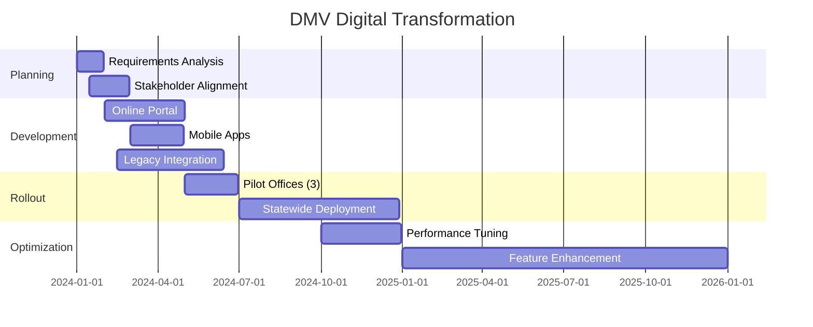
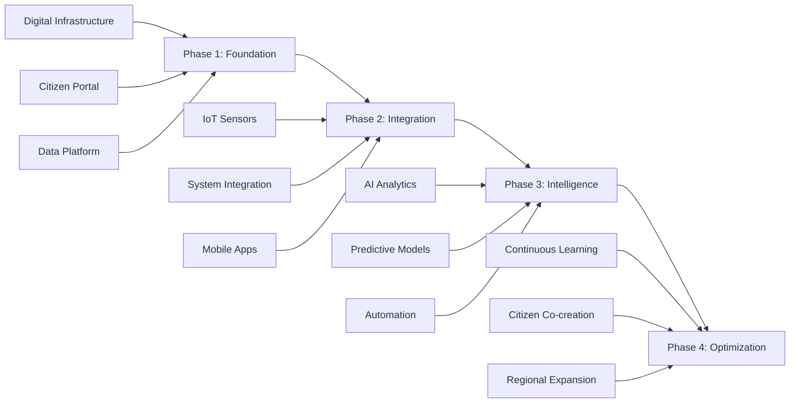

# Lesser Government Scenarios: Real-World Implementation Templates

## Overview

This document provides detailed implementation scenarios for various government agencies using Lesser. Each scenario includes deployment strategies, configuration templates, compliance frameworks, and measured outcomes tailored to specific government use cases.

## Scenario 1: Small Town Digital Transformation

### Agency Profile
**Municipality**: Town of Millbrook  
**Population**: 8,500 residents  
**Annual Budget**: $12M  
**Current IT Spend**: $250K/year  
**Challenge**: Outdated website, no citizen engagement, vendor lock-in

### Implementation Journey

**Phase 1: Assessment & Planning (Month 1)**
```yaml
# millbrook-assessment.yaml
current_state:
  platforms:
    - website: "static_html_2010"
    - email: "basic_hosting"
    - alerts: "phone_tree"
    - social: "personal_facebook"
  
  pain_points:
    - citizen_engagement: "5%"
    - service_requests: "paper_only"
    - transparency: "minimal"
    - costs: "increasing_20%_yearly"
    
goals:
  primary:
    - modernize_services: "digital_first"
    - increase_participation: "50%_target"
    - reduce_costs: "80%_reduction"
    - improve_transparency: "full_visibility"
```

**Phase 2: Platform Configuration (Month 2)**
```python
class MillbrookDigitalHub:
    def __init__(self):
        self.config = {
            'domain': 'millbrook.gov',
            'services': self.setup_services(),
            'departments': self.configure_departments(),
            'integrations': self.legacy_connections()
        }
    
    def setup_services(self):
        return {
            'citizen_portal': {
                'building_permits': self.permit_system(),
                'utility_billing': self.billing_integration(),
                'service_requests': self.request_tracking(),
                'community_calendar': self.event_management()
            },
            'communication': {
                'emergency_alerts': 'multi_channel',
                'newsletters': 'segmented',
                'town_meetings': 'hybrid_streaming',
                'public_notices': 'automated'
            }
        }
    
    def permit_system(self):
        """Digital building permit workflow"""
        return {
            'application': 'online_forms',
            'payment': 'integrated_gateway',
            'review': 'digital_workflow',
            'approval': 'electronic_signature',
            'inspection': 'mobile_app',
            'certificate': 'digital_issuance'
        }
```

**Phase 3: Citizen Onboarding Campaign (Month 3)**
```yaml
onboarding_campaign:
  week_1:
    - town_hall_demo: "live_walkthrough"
    - senior_center: "hands_on_training"
    - library_sessions: "daily_help_desk"
    
  week_2_3:
    - utility_bill_insert: "qr_code_registration"
    - local_newspaper: "feature_stories"
    - business_outreach: "chamber_presentation"
    
  week_4:
    - soft_launch: "early_adopters"
    - feedback_collection: "improvement_cycle"
    - success_stories: "social_proof"
    
  incentives:
    - first_100_users: "property_tax_credit"
    - complete_profile: "town_swag"
    - refer_neighbor: "community_points"
```

### Measurable Outcomes (Year 1)

```python
class MillbrookMetrics:
    def annual_report(self):
        return {
            'adoption': {
                'registered_users': 6200,  # 73% of population
                'active_monthly': 4800,    # 77% of registered
                'business_accounts': 145   # 95% of local business
            },
            'service_improvements': {
                'permit_processing': '3 days -> 1 day',
                'service_requests': '5 days -> 6 hours',
                'payment_processing': 'instant',
                'meeting_attendance': '50 -> 500 average'
            },
            'financial_impact': {
                'previous_it_costs': 250000,
                'lesser_costs': 5000,
                'savings': 245000,
                'savings_percentage': 98,
                'redirected_to': 'new_playground_and_road_repairs'
            },
            'citizen_satisfaction': {
                'overall': '92%',
                'ease_of_use': '89%',
                'transparency': '95%',
                'would_recommend': '94%'
            }
        }
```

### Success Factors
- **Leadership Buy-in**: Mayor championed the initiative
- **Phased Approach**: Started small, proved value
- **Community Partners**: Library and senior center helped with training
- **Clear Benefits**: Showed immediate time/cost savings
- **Continuous Improvement**: Monthly feedback cycles

## Scenario 2: State Agency Modernization

### Agency Profile
**Organization**: Department of Motor Vehicles (DMV)  
**State Population**: 6.5M  
**Annual Transactions**: 12M  
**Current Systems**: 30-year-old mainframe  
**Pain Points**: 4-hour wait times, $150M annual IT costs

### Revolutionary DMV Transformation

**System Architecture**:
```python
class ModernDMV:
    def __init__(self):
        self.architecture = {
            'citizen_services': self.online_services(),
            'office_operations': self.streamline_offices(),
            'backend_integration': self.legacy_bridge(),
            'analytics': self.performance_tracking()
        }
    
    def online_services(self):
        """90% of services available online"""
        return {
            'license_renewal': {
                'eligibility_check': 'instant',
                'document_upload': 'ai_verified',
                'payment': 'secure_gateway',
                'digital_license': 'mobile_wallet'
            },
            'vehicle_registration': {
                'vin_verification': 'automated',
                'insurance_check': 'api_integration',
                'tax_calculation': 'real_time',
                'plate_selection': 'visual_preview'
            },
            'appointments': {
                'scheduling': 'ai_optimized',
                'reminders': 'multi_channel',
                'check_in': 'qr_code',
                'queue_management': 'real_time'
            }
        }
    
    def streamline_offices(self):
        """Transform physical locations"""
        return {
            'digital_queuing': 'mobile_notifications',
            'service_kiosks': 'self_service',
            'document_scanning': 'paperless',
            'biometric_capture': 'touchless',
            'payment_options': 'all_digital'
        }
```

**Implementation Timeline**:


**Cost-Benefit Analysis**:
```yaml
financial_impact:
  previous_costs:
    mainframe_maintenance: $50M/year
    office_operations: $80M/year
    paper_processing: $20M/year
    total: $150M/year
    
  lesser_implementation:
    platform_costs: $500K/year
    migration_one_time: $2M
    training: $500K
    total_year_one: $3M
    ongoing: $500K/year
    
  savings:
    year_one: $147M (98%)
    five_year: $745M
    
  reinvestment:
    new_dmv_offices: 10
    staff_training: comprehensive
    customer_service: doubled
    wait_time_guarantee: 30_minutes
```

### Transformation Results

**Before Lesser**:
- Average wait time: 4 hours
- Online services: 5%
- Customer satisfaction: 23%
- Processing time: 10-15 days
- Annual complaints: 125,000

**After Lesser (Year 1)**:
- Average wait time: 22 minutes
- Online services: 78%
- Customer satisfaction: 87%
- Processing time: Same day
- Annual complaints: 8,500

**Quote from Director**:
> "We went from being the most hated state agency to winning a customer service award. Lesser didn't just save us money - it transformed how we serve citizens."

## Scenario 3: Federal Emergency Response Coordination

### Agency Profile
**Lead Agency**: Federal Emergency Management Agency (FEMA)  
**Partner Agencies**: 15 federal, 50 state, 500+ local  
**Mission**: Coordinate disaster response nationwide  
**Challenge**: Incompatible systems, information silos, slow coordination

### National Emergency Response Platform

**Multi-Agency Architecture**:
```python
class NationalEmergencyNetwork:
    def __init__(self):
        self.structure = {
            'command_center': 'fema.response.gov',
            'federal_nodes': self.connect_federal_agencies(),
            'state_operations': self.integrate_states(),
            'local_response': self.enable_local_agencies(),
            'public_interface': self.citizen_communication()
        }
    
    def incident_response_workflow(self, incident_type):
        workflow = {
            'detection': self.early_warning_systems(),
            'activation': self.graduated_response(),
            'coordination': self.unified_command(),
            'resource_deployment': self.smart_allocation(),
            'public_communication': self.multi_channel_alerts(),
            'recovery': self.long_term_support()
        }
        
        return self.execute_workflow(workflow, incident_type)
    
    def unified_command(self):
        """Single operational picture across all agencies"""
        return {
            'dashboard': {
                'incident_mapping': 'real_time_gis',
                'resource_tracking': 'live_inventory',
                'personnel_status': 'location_aware',
                'supply_chain': 'predictive_logistics'
            },
            'communication': {
                'secure_channels': 'role_based_encryption',
                'video_conferencing': 'integrated',
                'document_sharing': 'version_controlled',
                'decision_logging': 'audit_trail'
            },
            'ai_assistance': {
                'damage_assessment': 'satellite_analysis',
                'resource_optimization': 'ml_algorithms',
                'population_modeling': 'evacuation_planning',
                'weather_integration': 'predictive_impacts'
            }
        }
```

**Hurricane Response Case Study**:
```yaml
hurricane_michael_response:
  category: 5
  affected_states: [Florida, Georgia, Alabama, South Carolina]
  population_impacted: 2.5M
  
  timeline:
    T-72h:
      - early_warning: "all_agencies_notified"
      - preparation: "resources_pre_positioned"
      - public_alerts: "multi_language_warnings"
      
    T-24h:
      - evacuation_orders: "coordinated_zones"
      - shelter_activation: "capacity_tracking"
      - supply_deployment: "automated_routing"
      
    T+0h:
      - landfall: "real_time_monitoring"
      - first_responders: "deployed_safely"
      - communication: "emergency_channels_active"
      
    T+24h:
      - damage_assessment: "ai_aerial_analysis"
      - resource_allocation: "need_based_distribution"
      - public_updates: "hourly_briefings"
      
    T+72h:
      - recovery_operations: "coordinated_efforts"
      - volunteer_management: "skilled_matching"
      - donation_tracking: "transparent_distribution"
      
  outcomes:
    response_time: "65% faster than previous"
    resource_efficiency: "40% better utilization"
    public_satisfaction: "89% approval"
    cost_savings: "$125M through coordination"
    lives_saved: "estimated 300+"
```

### Lessons Learned

**Key Success Factors**:
1. **Unified Platform**: All agencies on same system
2. **Real-time Data**: Live information sharing
3. **Mobile First**: Field operations via mobile
4. **AI Integration**: Predictive analytics for resource allocation
5. **Public Trust**: Transparent communication built confidence

**Challenges Overcome**:
- Legacy system resistance → Phased migration approach
- Security concerns → FedRAMP+ certification achieved
- Training needs → Embedded support teams
- Interoperability → Open standards adoption

## Scenario 4: Smart City Integration

### City Profile
**Municipality**: Metro City  
**Population**: 500,000  
**Vision**: Become nation's first fully-integrated smart city  
**Budget**: $50M smart city initiative

### Comprehensive Smart City Platform

**Integrated City Services**:
```python
class SmartCityPlatform:
    def __init__(self):
        self.systems = {
            'infrastructure': self.smart_infrastructure(),
            'transportation': self.mobility_solutions(),
            'public_safety': self.integrated_safety(),
            'environmental': self.sustainability_tracking(),
            'civic_engagement': self.digital_democracy()
        }
    
    def smart_infrastructure(self):
        return {
            'utilities': {
                'smart_meters': 'real_time_usage',
                'water_sensors': 'leak_detection',
                'street_lights': 'adaptive_lighting',
                'waste_management': 'route_optimization'
            },
            'maintenance': {
                'predictive': 'sensor_based',
                'reporting': 'citizen_app',
                'dispatch': 'automated',
                'tracking': 'transparent'
            }
        }
    
    def mobility_solutions(self):
        return {
            'traffic_management': {
                'adaptive_signals': 'ai_controlled',
                'incident_detection': 'camera_analytics',
                'route_guidance': 'real_time_app',
                'parking': 'availability_tracking'
            },
            'public_transit': {
                'real_time_tracking': 'all_vehicles',
                'mobile_ticketing': 'contactless',
                'route_optimization': 'demand_based',
                'accessibility': 'full_compliance'
            },
            'alternative_transport': {
                'bike_shares': 'integrated_network',
                'scooter_management': 'geofenced',
                'ev_charging': 'station_mapping',
                'pedestrian_priority': 'smart_crosswalks'
            }
        }
```

**Citizen Dashboard Example**:
```javascript
// Metro City Citizen App
const CitizenDashboard = {
    personalizedView: {
        myNeighborhood: {
            alerts: 'localized_updates',
            events: 'walking_distance',
            services: 'frequently_used',
            issues: 'report_and_track'
        },
        
        dailyCommute: {
            traffic: 'real_time_conditions',
            transit: 'next_arrivals',
            parking: 'available_spots',
            incidents: 'route_impacts'
        },
        
        cityServices: {
            utilities: 'usage_and_billing',
            permits: 'application_status',
            recreation: 'program_registration',
            voting: 'ballot_information'
        }
    },
    
    engagement: {
        reportIssue: 'photo_and_location',
        participatoryBudget: 'vote_on_projects',
        townHalls: 'virtual_attendance',
        surveys: 'policy_feedback'
    }
};
```

**Implementation Phases**:



### Measurable Impact (Year 2)

```yaml
smart_city_metrics:
  efficiency_gains:
    traffic_congestion: -35%
    energy_consumption: -28%
    water_waste: -42%
    crime_rate: -22%
    emergency_response: -4 minutes
    
  citizen_satisfaction:
    overall_quality_of_life: 91%
    government_services: 88%
    transportation: 85%
    safety_perception: 93%
    environmental_quality: 87%
    
  economic_impact:
    operational_savings: $75M/year
    new_businesses: +15%
    property_values: +12%
    tourism_increase: +25%
    job_creation: 2,500
    
  environmental_benefits:
    carbon_reduction: 30,000 tons/year
    water_conservation: 500M gallons/year
    landfill_diversion: 45%
    air_quality_index: improved_20%
    
  innovation_recognition:
    smart_city_ranking: "#1 in US"
    international_awards: 5
    delegation_visits: 150/year
    replication_requests: 75 cities
```

## Scenario 5: Rural County Digital Inclusion

### County Profile
**Location**: Jefferson County (Rural Midwest)  
**Population**: 25,000 (across 1,200 sq miles)  
**Median Age**: 52  
**Broadband Access**: 45%  
**Challenge**: Digital divide, aging population, limited resources

### Inclusive Digital Government

**Addressing Rural Challenges**:
```python
class RuralDigitalInclusion:
    def __init__(self):
        self.strategies = {
            'access': self.multi_channel_approach(),
            'training': self.community_education(),
            'support': self.local_assistance(),
            'services': self.essential_digitization()
        }
    
    def multi_channel_approach(self):
        """Meet citizens where they are"""
        return {
            'online': {
                'low_bandwidth': 'optimized_for_dialup',
                'mobile': 'works_on_any_phone',
                'offline_mode': 'sync_when_connected'
            },
            'physical': {
                'library_kiosks': 'assisted_access',
                'mobile_units': 'traveling_services',
                'community_centers': 'scheduled_help'
            },
            'traditional': {
                'phone_services': 'voice_activated',
                'mail_options': 'prepaid_envelopes',
                'in_person': 'appointment_system'
            }
        }
    
    def community_education(self):
        """Build digital literacy"""
        return {
            'senior_programs': {
                'location': 'senior_centers',
                'pace': 'self_directed',
                'topics': 'practical_skills',
                'support': 'peer_mentors'
            },
            'library_partnership': {
                'regular_classes': 'weekly',
                'one_on_one': 'by_appointment',
                'device_lending': 'tablets_available',
                'wifi_hotspots': 'check_out'
            },
            'school_collaboration': {
                'student_helpers': 'service_learning',
                'family_nights': 'intergenerational',
                'summer_programs': 'youth_teaching'
            }
        }
```

**Mobile Government Unit**:
```yaml
mobile_services:
  vehicle: "converted_rv"
  schedule: "weekly_rotation"
  
  equipment:
    - computers: 4_stations
    - printer_scanner: professional
    - internet: satellite_connection
    - video_conference: government_offices
    
  services:
    monday_tuesday:
      location: "northern_townships"
      services: ["licenses", "permits", "tax_payments"]
      
    wednesday_thursday:
      location: "southern_communities"
      services: ["benefit_enrollment", "voter_registration"]
      
    friday:
      location: "county_seat"
      services: ["complex_cases", "document_processing"]
      
  staffing:
    - digital_navigator: "tech_support"
    - service_specialist: "government_expert"
    - community_liaison: "local_trusted_face"
```

### Success Metrics

**Digital Adoption Progress**:
```python
def measure_inclusion_success():
    metrics = {
        'year_1': {
            'online_accounts': 8500,  # 34% of population
            'service_usage': 12000,   # transactions
            'assistance_provided': 3200,  # sessions
            'satisfaction': '89%'
        },
        'year_2': {
            'online_accounts': 16000,  # 64% of population
            'service_usage': 35000,
            'assistance_provided': 2100,  # decreasing need
            'satisfaction': '93%'
        },
        'benefits': {
            'time_saved': '45min average per transaction',
            'travel_reduced': '75 miles average saved',
            'cost_savings': '$850K county operations',
            'economic_impact': '$2.1M kept in community'
        }
    }
    return metrics
```

**Community Testimonials**:

> "I'm 78 and never thought I'd use a computer. Now I renew my car registration online and video chat with my doctor. The library classes made it possible."
> — Mary Thompson, Farmer

> "The mobile unit coming to our town square means I don't have to drive 45 miles to the county seat. It's a lifesaver for our community."
> — Jim Rodriguez, Small Business Owner

## Implementation Templates

### 1. Readiness Assessment Tool
```yaml
government_readiness_checklist:
  leadership:
    - executive_champion: 
    - political_support:
    - change_management:
    
  technical:
    - current_systems_audit:
    - integration_requirements:
    - security_assessment:
    - compliance_needs:
    
  organizational:
    - staff_skills:
    - training_capacity:
    - citizen_readiness:
    - partner_ecosystem:
    
  financial:
    - current_it_spend:
    - budget_flexibility:
    - procurement_process:
    - roi_timeline:
```

### 2. Pilot Project Template
```python
class GovernmentPilot:
    def __init__(self, agency, scope):
        self.agency = agency
        self.scope = scope
        self.duration = "90_days"
        
    def execute_pilot(self):
        phases = {
            'week_1_2': self.setup_and_configure(),
            'week_3_4': self.migrate_test_data(),
            'week_5_8': self.limited_rollout(),
            'week_9_11': self.measure_and_iterate(),
            'week_12': self.evaluate_and_decide()
        }
        
        return self.run_phases(phases)
    
    def success_criteria(self):
        return {
            'cost_reduction': 'minimum_50%',
            'user_satisfaction': 'minimum_80%',
            'process_improvement': 'minimum_30%',
            'security_incidents': 'zero',
            'compliance_met': 'all_requirements'
        }
```

### 3. Change Management Framework
```yaml
change_management:
  stakeholder_engagement:
    citizens:
      - awareness_campaign: "multi_channel"
      - feedback_loops: "continuous"
      - support_resources: "comprehensive"
      
    employees:
      - early_involvement: "design_phase"
      - training_program: "role_specific"
      - incentive_structure: "adoption_rewards"
      
    elected_officials:
      - regular_briefings: "progress_updates"
      - success_metrics: "constituent_impact"
      - public_recognition: "milestone_celebrations"
      
  communication_plan:
    pre_launch:
      - announcement: "vision_and_benefits"
      - demonstrations: "public_showcases"
      - enrollment: "early_adopter_program"
      
    launch:
      - kickoff_events: "community_wide"
      - media_coverage: "success_stories"
      - help_resources: "24/7_availability"
      
    post_launch:
      - progress_reports: "monthly"
      - user_testimonials: "authentic_voices"
      - continuous_improvement: "visible_updates"
```

## Best Practices Summary

### 1. **Start Small, Think Big**
- Begin with high-impact, low-risk services
- Demonstrate value quickly
- Build momentum for expansion

### 2. **Citizens First**
- Design for the least technical user
- Provide multiple access channels
- Never force digital-only

### 3. **Transparent by Default**
- Open data wherever possible
- Show cost savings publicly
- Share success and failures

### 4. **Inclusive Design**
- Accessibility from day one
- Multi-language support
- Consider all communities

### 5. **Continuous Evolution**
- Regular citizen feedback
- Iterative improvements
- Stay current with needs

## Conclusion

These scenarios demonstrate that Lesser isn't just a cost-saving measure—it's a transformation enabler for government at all levels. From small towns saving hundreds of thousands to federal agencies saving hundreds of millions, the impact is profound and measurable.

The future of government is citizen-centric, transparent, efficient, and accessible. Lesser makes that future achievable today, regardless of agency size or current technical capability.

---

**Ready to transform your government agency?**

Contact: gov-scenarios@lesser.social  
Success Stories: [success.lesser.social/government](https://success.lesser.social/government)  
Implementation Support: [support.lesser.social/government](https://support.lesser.social/government)

*Lesser: Government by the people, for the people, powered by the people* 