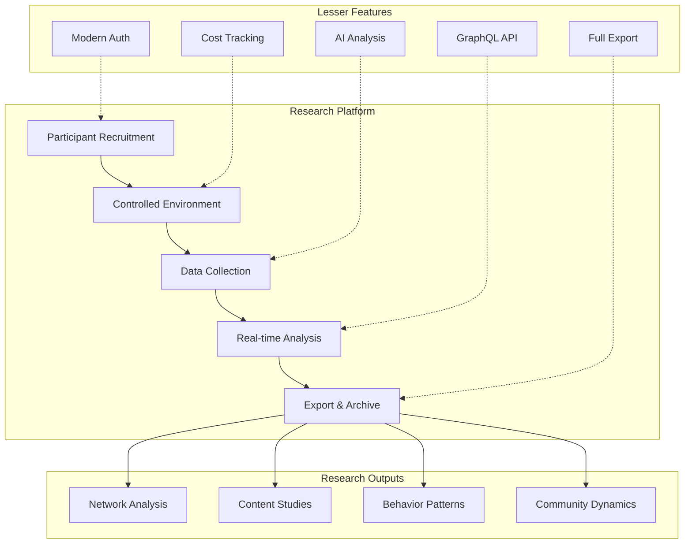
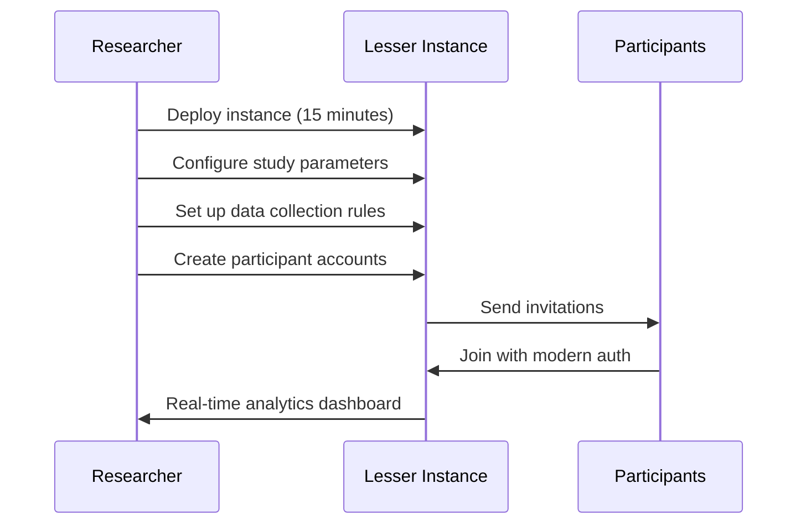

# Lesser as a Research Platform: Democratizing Social Media Studies

## Executive Summary

Lesser transforms social media research by providing an affordable, fully-controlled, feature-rich platform for conducting studies. At 1/100th the cost of traditional infrastructure, researchers can run large-scale, long-term studies with complete data control, built-in analytics, and AI-powered analysis tools.

**Key Value Proposition**: Run a 1,000-participant social media study for ~$50/month instead of $500-5,000/month, while gaining unprecedented control and analytical capabilities.

## Why Lesser for Research?

### 1. Economic Enabler
Traditional social media research faces significant barriers:
- **High Infrastructure Costs**: $500-5,000/month for hosted instances
- **Technical Complexity**: Requires dedicated IT staff
- **Limited Control**: Dependent on platform APIs and policies
- **Data Access**: Restricted by platform terms of service

Lesser removes these barriers:
- **Minimal Costs**: $0.01-0.05 per participant per month
- **Zero Maintenance**: Serverless architecture manages itself
- **Complete Control**: Own all data and infrastructure
- **Full Access**: Every interaction, metric, and data point available

### 2. Research-First Features



## Research Use Cases

### 1. Social Network Formation Studies

**Research Question**: How do trust networks form in decentralized communities?

**Lesser Implementation**:
```python
# Track trust network evolution
GET /api/v1/moderation/trust/graph
{
  "nodes": [
    {"id": "user1", "trust_score": 0.85},
    {"id": "user2", "trust_score": 0.72}
  ],
  "edges": [
    {"from": "user1", "to": "user2", "weight": 0.9, "category": "content"}
  ]
}

# Analyze trust propagation over time
GET /api/v1/analytics/trust/evolution?days=30
```

**Unique Capabilities**:
- Real-time trust score calculation
- Category-based trust (content, behavior, technical)
- Complete audit trail of trust changes
- PageRank-style trust propagation

### 2. Content Moderation Research

**Research Question**: How do communities self-govern without central authority?

**Lesser's Reactive Moderation Mesh**:
```json
{
  "event": "content_flagged",
  "consensus_process": {
    "reviewers": 5,
    "weighted_votes": {
      "remove": 0.72,
      "keep": 0.28
    },
    "trust_weights_applied": true,
    "decision": "remove",
    "confidence": 0.85
  }
}
```

**Research Benefits**:
- Study consensus formation in real-time
- Analyze trust's impact on moderation
- Compare different governance models
- Full transparency in decision-making

### 3. Information Propagation Studies

**Research Question**: How does information spread in federated networks?

**Federation Tracking**:
```python
# Track post propagation
GET /api/v1/debug/federation/trace/activity_123
{
  "origin": "research.instance",
  "propagation": [
    {"instance": "peer1.social", "latency_ms": 234, "timestamp": "..."},
    {"instance": "peer2.social", "latency_ms": 567, "timestamp": "..."}
  ],
  "total_reach": 1523,
  "propagation_speed": "2.3 instances/second"
}
```

### 4. AI Content Detection Research

**Research Question**: How do users interact with AI-generated content?

**Built-in AI Analysis**:
```json
{
  "content_analysis": {
    "ai_generated_probability": 0.89,
    "sentiment": "positive",
    "toxicity": 0.02,
    "languages_detected": ["en"],
    "engagement_rate": 0.23
  },
  "user_reactions": {
    "aware_of_ai": true,
    "trust_impact": -0.15
  }
}
```

### 5. Digital Behavior Studies

**Research Question**: What drives user engagement in decentralized platforms?

**Comprehensive Analytics**:
```python
# User behavior tracking
GET /api/v1/accounts/participant_123/analytics
{
  "posting_patterns": {
    "peak_hours": [9, 17, 21],
    "average_posts_per_day": 3.2,
    "content_types": {"text": 0.6, "media": 0.3, "polls": 0.1}
  },
  "engagement_metrics": {
    "gives": {"likes": 45, "boosts": 12, "replies": 23},
    "receives": {"likes": 123, "boosts": 34, "replies": 56}
  },
  "network_position": {
    "centrality": 0.67,
    "clustering_coefficient": 0.34
  }
}
```

## Research Workflows

### 1. Study Setup Workflow



### 2. Data Collection Workflow

**Automated Collection**:
```python
# Set up automated data export
POST /api/v1/research/collection
{
  "schedule": "daily",
  "export_format": "json",
  "include": [
    "posts", "interactions", "network_changes",
    "moderation_events", "trust_updates"
  ],
  "anonymize": true,
  "destination": "s3://research-bucket/study-123/"
}
```

**Real-time Streaming**:
```javascript
// Stream events for real-time analysis
const ws = new WebSocket('wss://study.instance/research/stream');
ws.on('message', (event) => {
  // Process events as they happen
  analyzeEvent(JSON.parse(event));
});
```

### 3. Analysis Workflow

**GraphQL for Complex Queries**:
```graphql
query StudyAnalysis($startDate: DateTime!, $endDate: DateTime!) {
  participants(active: true) {
    id
    posts(from: $startDate, to: $endDate) {
      content
      sentiment
      engagement {
        likes
        replies
        propagation
      }
    }
    trustNetwork {
      score
      changes(period: DAILY)
    }
  }
}
```

## Technical Implementation

### 1. Research Instance Configuration

```yaml
# research-config.yaml
instance:
  mode: research
  features:
    cost_tracking: enabled
    ai_analysis: enabled
    federation: controlled  # or 'isolated' for closed studies
    
research:
  study_id: "trust-formation-2024"
  duration: "6 months"
  participants: 500
  
  data_collection:
    - all_interactions
    - trust_changes
    - moderation_events
    - cost_per_action
    
  privacy:
    anonymize_exports: true
    participant_pseudonyms: true
    irb_protocol: "IRB-2024-123"
    
  constraints:
    rate_limits:
      posts_per_day: 50
      interactions_per_hour: 100
    content_filters:
      - no_external_links
      - research_topics_only
```

### 2. Custom Research Endpoints

Lesser can be extended with research-specific endpoints:

```go
// Custom research API endpoints
POST /api/v1/research/participants/bulk   // Bulk create participants
GET /api/v1/research/analytics/summary    // Study-wide analytics
POST /api/v1/research/interventions       // Trigger study interventions
GET /api/v1/research/export/complete      // Full study data export
```

### 3. Research Dashboard

**Proposed Dashboard Features**:
- Real-time participant activity
- Network visualization
- Content analysis streams
- Intervention controls
- Export scheduling
- Cost tracking
- Compliance monitoring

## Cost Analysis for Research

### Scenario 1: Small Pilot Study
**25 participants, 3 months**
```
Infrastructure: $1.25/month × 3 = $3.75
AI Analysis: ~$10 total
Storage: ~$1
Total: ~$15 for entire pilot
```

### Scenario 2: Medium Study
**500 participants, 6 months**
```
Infrastructure: $25/month × 6 = $150
AI Analysis: ~$100
Storage: ~$25
Admin Dashboard: ~$25
Total: ~$300 for entire study
```

### Scenario 3: Large Longitudinal Study
**5,000 participants, 2 years**
```
Infrastructure: $250/month × 24 = $6,000
AI Analysis: ~$2,000
Storage: ~$500
Custom Development: ~$5,000
Total: ~$13,500 for entire study

Traditional approach: $120,000+
Savings: ~89%
```

## Ethical Considerations

### 1. Participant Rights
- **Data Ownership**: Participants own their data
- **Right to Delete**: Complete data removal capability
- **Transparency**: Cost tracking shows resource usage
- **Portability**: Export all personal data

### 2. Research Ethics
- **Informed Consent**: Built-in consent workflows
- **Anonymization**: Automatic PII removal
- **Audit Trail**: Complete record for IRB
- **Intervention Limits**: Configurable constraints

### 3. Privacy by Design
```python
# Anonymization example
GET /api/v1/research/export?anonymize=true
{
  "participants": [
    {
      "id": "P001",  # Not "alice@example.com"
      "posts": [...],
      "metadata": {
        "account_age_days": 45,
        "timezone": "UTC-5"  # Not specific location
      }
    }
  ]
}
```

## Implementation Roadmap

### Phase 1: Basic Research Mode (Week 1-2)
- [ ] Research configuration schema
- [ ] Participant bulk creation
- [ ] Basic analytics endpoints
- [ ] Export functionality

### Phase 2: Advanced Analytics (Week 3-4)
- [ ] Real-time streaming API
- [ ] Network analysis tools
- [ ] Content analysis pipeline
- [ ] Research dashboard MVP

### Phase 3: Research Tools (Week 5-6)
- [ ] Intervention system
- [ ] A/B testing framework
- [ ] Automated reporting
- [ ] Collaboration features

### Phase 4: Publication Support (Week 7-8)
- [ ] Data visualization exports
- [ ] Statistical summaries
- [ ] Reproducibility packages
- [ ] Archival formats

## Getting Started

### 1. Quick Start for Researchers

```bash
# 1. Clone research template
git clone https://github.com/lesser/research-template
cd research-template

# 2. Configure your study
cp config.example.yaml config.yaml
# Edit config.yaml with your study parameters

# 3. Deploy your instance
cd infra
pulumi up -y

# 4. Create participants
python scripts/create_participants.py --count 100

# 5. Start collecting data!
```

### 2. Example Study Configurations

**Social Network Study**:
```yaml
federation: enabled
ai_analysis: true
moderation: reactive_mesh
data_collection: all
```

**Controlled Experiment**:
```yaml
federation: disabled
ai_analysis: false
moderation: researcher_controlled
data_collection: specific_events
```

**Longitudinal Observation**:
```yaml
federation: enabled
ai_analysis: true
moderation: community
data_collection: sampled
```

## Support for Researchers

### 1. Documentation
- Research-specific guides
- IRB template documents
- Data management plans
- Publication guidelines

### 2. Tools & Libraries
- Python SDK for data analysis
- R package for statistics
- Network analysis tools
- Visualization libraries

### 3. Community
- Research user group
- Shared study designs
- Collaboration opportunities
- Best practices forum

## Conclusion

Lesser democratizes social media research by removing economic and technical barriers while providing unprecedented control and analytical capabilities. Researchers can focus on their studies rather than infrastructure, collect richer data than ever before, and conduct ethical research with built-in privacy protections.

The combination of minimal costs, zero maintenance, complete data control, and advanced features makes Lesser the ideal platform for the next generation of social media research.

---

**Ready to revolutionize your research?** Deploy your first Lesser research instance in 15 minutes and start collecting data today.

Contact: research@lesser.social | [Research Portal](https://research.lesser.social) 